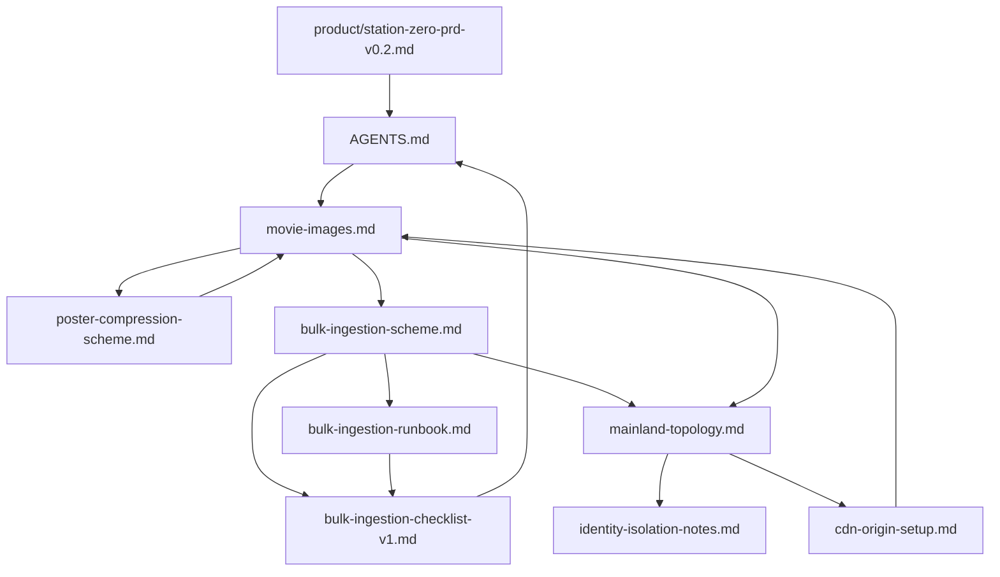

# Station Zero 文档索引

> **给 Agent 的入口**：改代码前先读 [AGENTS.md](../AGENTS.md)；涉及产品范围、批量录入、部署或图片策略时，再按下方「按任务选读」打开对应文档。本文档是 `docs/` 的目录与阅读地图，不替代各专题正文。

## 文档分层

| 层级 | 目录 | 用途 |
|------|------|------|
| 开发约定 | 仓库根 `AGENTS.md`、`README.md` | 目录结构、命令、数据流、编码规范、当前实施进度 |
| 产品方向 | `docs/product/` | 定位、MVP 范围、信息架构、合规边界 |
| 技术决策 | `docs/technical/` | 架构方案、录入流水线、图片缓存、生产部署 |
| 历史计划 | `docs/archive/plans/` | 已落地或归档的实施计划（参考用，以代码为准） |

## 命名与 front matter 约定

| 规则 | 说明 |
|------|------|
| 文件名 | 英文 kebab-case；中文标题写在文档 `#` 一级标题 |
| 配对前缀 | 同一主线共享前缀，如 `bulk-ingestion-scheme` + `bulk-ingestion-checklist-v1` |
| 版本后缀 | `prd-v0.1`、`bulk-ingestion-checklist-v1` |
| 归档日期前缀 | `archive/plans/2026-06-23-theme-modes.md` |
| front matter | 每篇文档顶部 YAML：`title`、`type`、`status`、`updated`、`related` |

**`type` 取值：** `index` | `prd` | `architecture` | `runbook` | `decision` | `archive`

**`status` 取值：** `draft` | `active` | `pending` | `implemented` | `superseded`

## 按任务选读

| 你想做什么 | 先读 | 再读 |
|------------|------|------|
| 理解产品是什么、详情页要展示什么 | [station-zero-prd-v0.2.md](./product/station-zero-prd-v0.2.md) | `AGENTS.md` 页面路由与组件表 |
| 日常改页面 / 组件 / 读取层 | `AGENTS.md` | [movie-images.md](./technical/movie-images.md)（数据与图片原则） |
| 人工录入单部或少量影片 | `AGENTS.md` → Agent 专用说明 | [movie-images.md](./technical/movie-images.md) § 当前项目落地状态 |
| 规划或实现万级批量录入 | [bulk-ingestion-runbook.md](./technical/bulk-ingestion-runbook.md) | [bulk-ingestion-checklist-v1.md](./technical/bulk-ingestion-checklist-v1.md) → [bulk-ingestion-scheme.md](./technical/bulk-ingestion-scheme.md) |
| 选型 CDN / VPS / 大陆访问与隐私 | [mainland-topology.md](./technical/mainland-topology.md) | [identity-isolation-notes.md](./technical/identity-isolation-notes.md) → [bulk-ingestion-scheme.md](./technical/bulk-ingestion-scheme.md) § 生产部署 |
| 配置 CDN 回源、Tunnel、源站隐藏 | [cdn-origin-setup.md](./technical/cdn-origin-setup.md) | [mainland-topology.md](./technical/mainland-topology.md) |
| 理解海报 URL、Storage、CDN 关系 | [movie-images.md](./technical/movie-images.md) § 生产环境海报 URL 策略 | [cdn-origin-setup.md](./technical/cdn-origin-setup.md) § 媒体子域 |
| 评估 Supabase 海报体积优化（100+ 存量） | [poster-compression-scheme.md](./technical/poster-compression-scheme.md) | [movie-images.md](./technical/movie-images.md) § 图片处理建议 |
| 查某次功能的历史实施步骤 | `docs/archive/plans/` 对应文件 | 以 `src/` 与 `tests/` 实际代码为准 |

## 文档目录

### 产品 `docs/product/`

#### [station-zero-prd-v0.2.md](./product/station-zero-prd-v0.2.md)（当前）

| 属性 | 值 |
|------|-----|
| type / status | `prd` / `draft` |
| 何时读 | 产品边界、详情页模块、资源索引（网盘/迅雷/磁力）、合规声明 |
| 核心内容 | 四维定位（值不值得看 / 版本 / 正版 / 资源索引）；观看来源聚合模块；不托管视频；侵权投诉流程 |
| 与代码关系 | 对齐 `watch-providers`、`ViewingPath`；`迅雷` 类型待工程补全 |

#### [station-zero-prd-v0.1.md](./product/station-zero-prd-v0.1.md)（已废止）

| 属性 | 值 |
|------|-----|
| type / status | `prd` / `superseded` |
| 说明 | 禁止展示网盘/磁力链接；仅供与 v0.2 对照，勿作实现依据 |

---

### 技术 `docs/technical/`

#### [movie-images.md](./technical/movie-images.md)

| 属性 | 值 |
|------|-----|
| type / status | `architecture` / `active` |
| 何时读 | 改图片路径、同步脚本、缓存头、`movie-api` 读取原则、海报 URL 策略 |
| 核心内容 | 外部 API 仅后台同步，前端只读本站 URL；`data/movies.json` / `movie-seeds.json`；`/media` 长缓存；生产 URL A/B/C |
| 关键路径 | `scripts/legacy/sync-movies.mjs`、`scripts/bulk-ingest/`、`src/lib/movie-api.ts`、`next.config.ts` |

#### [bulk-ingestion-scheme.md](./technical/bulk-ingestion-scheme.md)

| 属性 | 值 |
|------|-----|
| type / status | `architecture` / `draft` |
| 何时读 | 需要完整背景、竞品分析、Schema 草案、流水线设计、风险对策 |
| 核心内容 | 1 万+ 条录入；Supabase 作数据层、浏览器不直连；`import_staging` 流水线；大陆可访问 + 隐私隔离 |
| 章节导航 | 背景与目标 → 竞品 → 现状瓶颈 → 目标架构 → 生产部署 → 数据模型 → 读取层 → 批量流水线 → 风险 |

#### [bulk-ingestion-runbook.md](./technical/bulk-ingestion-runbook.md)

| 属性 | 值 |
|------|-----|
| type / status | `runbook` / `active` |
| 何时读 | **实际操作** bulk-ingest 流水线、Pilot 复跑、消歧 / failed 人工介入 |
| 核心内容 | Step 0–3 命令；ambiguous / failed 三轮消歧；Pilot 数据与经验；报告路径；复用 Checklist |
| 与上篇关系 | 本文是操作手册；架构见 `bulk-ingestion-scheme`；勾选进度见 `bulk-ingestion-checklist-v1` |

#### [bulk-ingestion-checklist-v1.md](./technical/bulk-ingestion-checklist-v1.md)

| 属性 | 值 |
|------|-----|
| type / status | `runbook` / `pending` |
| 何时读 | 实际开工批量录入 / SQL 迁移 / 生产部署时 |
| 核心内容 | Phase 0–6 可勾选任务；依赖关系与阻塞项 |
| 与上篇关系 | 本文是动作清单；决策依据见 `bulk-ingestion-scheme.md` |

#### [mainland-topology.md](./technical/mainland-topology.md)

| 属性 | 值 |
|------|-----|
| type / status | `decision` / `pending` |
| 何时读 | 定 CDN、VPS 区域、回源方式、防火墙与拨测 |
| 核心内容 | 境外 VPS + CDN 回源 + 源站隐藏；VPS/CDN 对比；回源 Header / mTLS；`media.` 子域出图 |
| 对应清单任务 | **D1**、Phase 6 **G1–G5** |
| 配置实操 | 见 [cdn-origin-setup.md](./technical/cdn-origin-setup.md) |

#### [identity-isolation-notes.md](./technical/identity-isolation-notes.md)

| 属性 | 值 |
|------|-----|
| type / status | `decision` / `active` |
| 何时读 | 使用低 KYC VPS（如 Akile）时的账户、网络、支付隔离纪律 |
| 核心内容 | 专用邮箱/浏览器；TUN VPN + Kill Switch；支付隔离；2FA；工单信息最小化 |
| 与上篇关系 | 补充 `mainland-topology` § VPS 隐私/KYC 的操作细则 |

#### [cdn-origin-setup.md](./technical/cdn-origin-setup.md)

| 属性 | 值 |
|------|-----|
| type / status | `architecture` / `active` |
| 何时读 | 理解 CDN 回源逻辑；配置 Cloudflare Tunnel / Header 鉴权；媒体子域与缓存规则 |
| 核心内容 | 回源时序；主站与 `media.` 双链路；方案 A/D 配置步骤；上线检查清单 |
| 与上篇关系 | 选型见 `mainland-topology`；图片策略见 `movie-images` |

#### [poster-compression-scheme.md](./technical/poster-compression-scheme.md)

| 属性 | 值 |
|------|-----|
| type / status | `architecture` / `draft` |
| 何时读 | Supabase 海报 ~200KB、要对齐竞品 ~30KB、规划存量 100+ 重压缩与入库规则 |
| 核心内容 | 现状与问题；方案 A–D 对比；推荐「480px WebP + 存量 recompress」；Pilot 流程与验收 SQL |
| 关键路径 | `scripts/bulk-ingest/sync-movies-to-sql.mts`、`storage-media.mts`、`media_assets.byte_size` |
| 与上篇关系 | 落实 [movie-images.md](./technical/movie-images.md) § 图片处理建议；万级前建议先落地 |

---

### 归档 `docs/archive/plans/`

#### [2026-06-23-theme-modes.md](./archive/plans/2026-06-23-theme-modes.md)

| 属性 | 值 |
|------|-----|
| type / status | `archive` / `implemented` |
| 何时读 | 仅当继续改主题系统或需了解当初任务拆分 |
| 说明 | 以 `src/lib/theme.ts`、`src/components/theme-toggle.tsx`、`globals.css` 为准 |

---

## 文档依赖关系

**阅读顺序建议：**

- **万级录入主线：** `movie-images`（现状）→ `bulk-ingestion-scheme`（方案）→ **`bulk-ingestion-runbook`（操作）** → `bulk-ingestion-checklist-v1`（进度勾选）→ `mainland-topology`（部署选型）→ **`cdn-origin-setup`（回源配置）**
- **海报体积优化：** `movie-images` § 图片处理建议 → `poster-compression-scheme`（draft）
- **低 KYC VPS：** `mainland-topology` → `identity-isolation-notes`

## 方案状态 vs 仓库实现（2026-06）

| 能力 | 文档描述 | 仓库现状 |
|------|----------|----------|
| 文件型电影库 + JSON 回退 | `movie-images` | ✅ `data/movies.json`、`movie-store` |
| TMDB 后台同步 + 本地海报 | 同上 | ✅ `sync:movies`、`public/media/` |
| SQL 读取层（Supabase） | `bulk-ingestion` Phase 2 | ✅ Drizzle、`movie-sql-store`、`movie-api` 优先 SQL |
| JSON → SQL 迁移 | 可执行清单 S3 | ✅ `db:migrate:json` |
| 列表 SQL 分页、详情 JOIN | 可执行清单 R1–R3 | ✅ `/movies`、`/movies/[slug]` |
| 批量 staging 录入脚本 | 可执行清单 P1–P4 | ✅ `scripts/bulk-ingest/`（Pilot 已验证 100 部） |
| 海报上传 Supabase Storage | 可执行清单 S4 | ✅ `ingest:sync` + `ingest:upload-media`（需 `SUPABASE_SERVICE_ROLE_KEY`） |
| 海报入库压缩（WebP / 480px） | `poster-compression-scheme` | ❌ 方案 `draft`；当前默认 `w780` 原图上传 |
| 生产 VPS + CDN 部署 | `mainland-topology` + Phase 6 | ❌ 待决策与实施；配置步骤见 `cdn-origin-setup` |

更细的命令与路径约定以 [AGENTS.md](../AGENTS.md) 文末「当前实施进度」为准；文档与代码冲突时，**以代码与 `AGENTS.md` 为权威**，并应反馈更新文档。

## 维护约定

- 新增 `docs/` 下 Markdown 时：英文 kebab-case 文件名 + front matter + 在本文件「文档目录」补一行。
- 方案从 `draft` / `pending` 变为 `implemented` 时：更新 front matter `status`，并将细节沉淀到 `AGENTS.md` 或 `README.md`。
- `docs/archive/plans/` 仅放带 checkbox 的历史实施计划；完成后标 `status: implemented` 并链接实际代码路径。
