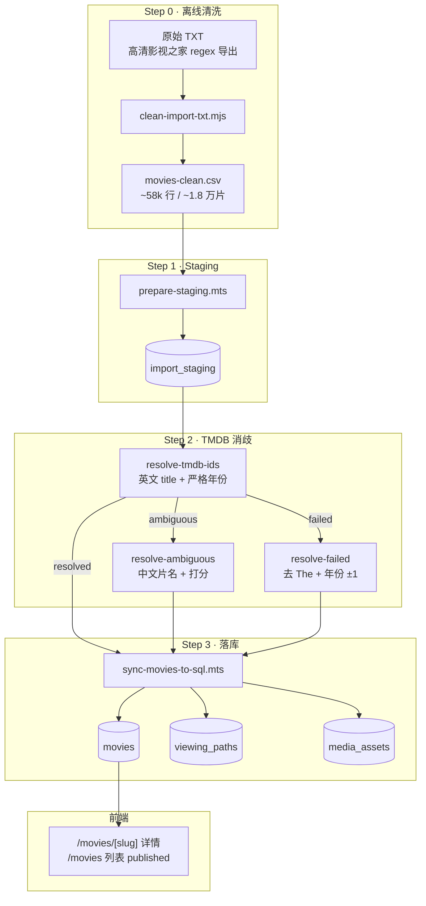

# 万级影视批量录入 — 流水线 Runbook

> **定位**：本文是 bulk-ingest 流水线的**操作手册与 Pilot 经验沉淀**，供后续分批复用。架构背景见 [bulk-ingestion-scheme.md](./bulk-ingestion-scheme.md)；分阶段勾选任务见 [bulk-ingestion-checklist-v1.md](./bulk-ingestion-checklist-v1.md)。脚本细节见 [scripts/bulk-ingest/index.md](../../scripts/bulk-ingest/index.md)。

## 一、架构原则

与站点现有约定一致：

- **TMDB 只用于后台生产**，页面经 `movie-api` 读 Supabase SQL，未配置 `DATABASE_URL` 时回退 JSON
- **磁力链来自 CSV**，sync 阶段不用 TMDB 正版路径覆盖 staging 链接
- **策展字段占位**（`verdict`、`bestWay` 等）默认「待人工补充」；TMDB 只补客观资料
- **默认 `draft`**：列表页只展示 `published`；Pilot 验收后再 `--publish`
- **大 CSV / 原始 TXT 不进 Git**，只保留脚本、报告摘要与 [data/import/index.md](../../data/import/index.md)

## 二、完整数据流



## 三、各步骤职责

| 步骤 | 脚本 | 输入 → 输出 | 说明 |
|------|------|-------------|------|
| **0 清洗** | `clean-import-txt.mjs` | TXT → CSV | 解析片名、中文名、年份、磁力、slug；缺 year 的进 `movies-needs-review.csv` |
| **1 Staging** | `prepare-staging.mts` | CSV → `import_staging` | 每行一条磁力；`--limit-movies N` 控制 Pilot 规模；`--batch-id` 串联全流程 |
| **2a 初轮消歧** | `resolve-tmdb-ids.mts` | staging → `tmdb_id` | 按 `(title, year)` 搜 TMDB：唯一 → resolved，多个 → ambiguous，无 → failed |
| **2b ambiguous** | `resolve-ambiguous.mts` | ambiguous → resolved | 用 `title_zh` 复搜 + 候选打分；高置信自动，其余导出人工表 |
| **2c failed** | `resolve-failed.mts` | failed → resolved | 用中文片名、去 `The` 前缀、年份 ±1 重试 |
| **3 落库** | `sync-movies-to-sql.mts` | resolved → SQL + 海报 | 拉 TMDB 详情、下载海报/背景、写入磁力 viewing paths |

共享逻辑：`scripts/bulk-ingest/shared.mts`（CSV 解析、TMDB 客户端、打分、字段映射）。

## 四、命令速查

### 环境预检

```bash
npm run check:database   # DATABASE_URL + 四表
npm run check:tmdb       # TMDB 凭证与网络
npm run db:migrate       # 首次需跑 migration
```

### 离线清洗（源数据更新时）

```bash
node scripts/bulk-ingest/clean-import-txt.mjs \
  data/import/raw/高清影视之家-资源.txt \
  data/import/movies-clean.csv
```

### Pilot 一键（默认 100 部，不含清洗）

```bash
npm run ingest:pilot
# 或指定 batch
npm run ingest:pilot -- --batch-id pilot-20260628 --limit-movies 100
```

### 分步执行（推荐，便于排查）

```bash
# Windows PowerShell 可先设变量：$BATCH = "pilot-20260628"

npm run ingest:staging -- --limit-movies 100 --batch-id pilot-20260628
npm run ingest:resolve -- --batch-id pilot-20260628
npm run ingest:resolve-ambiguous -- --batch-id pilot-20260628   # 有 ambiguous 时
npm run ingest:resolve-failed -- --batch-id pilot-20260628       # 有 failed 时
npm run ingest:sync -- --batch-id pilot-20260628
npm run ingest:sync -- --batch-id pilot-20260628 --publish       # 验收后上列表
npm run ingest:upload-media                                      # 本地海报 → Supabase Storage
```

## 五、Pilot 实战记录（`pilot-20260628`）

### 规模与结果

| 指标 | 数值 |
|------|------|
| 全量清洗 CSV | 58,086 行磁力 / 17,940 部唯一片 |
| Pilot staging 行数 | 643 行磁力 |
| Pilot 唯一片（按 `title_zh + year`） | ~100 部 |
| Resolve 分组（按 `title + year`） | 132 组（中英文 title 重复计数） |
| 初轮 resolved / ambiguous / failed | 93 / 32 / 7 |
| ambiguous 自动 + 人工后 | 0 剩余 |
| failed 重试后 | 0 剩余 |
| 最终 sync | **101 组 TMDB 唯一片，0 失败** |

### 消歧三类问题与对策

| 类型 | 典型原因 | 处理方式 |
|------|----------|----------|
| **ambiguous** | 同 year 多候选、短 title 撞名 | `resolve-ambiguous` 自动 + 人工 CSV |
| **failed** | 英文 title 搜不到；TMDB 年份差 1 年；多了 `The` | `resolve-failed` 用中文片名 + 年份容差 |
| **误匹配** | CSV `original_title` 误标（如 Hate → La Haine） | 人工写 resolutions CSV 回写 |

### 人工介入

脚本跑完后若仍有 ambiguous / failed，会生成：

- `data/import/ambiguous-manual.csv` — 需人工确认的 ambiguous
- `data/import/failed-manual.csv` — failed 重试仍无法自动解决的条目

确认 TMDB ID 后，写入 resolutions CSV（`note` 列可选）：

```csv
title,year,tmdb_id,note
Hate,1995,406,实为 La Haine
Girl,2025,1357759,台湾片《女孩》
```

回写命令（`title` + `year` 必须与 staging 分组键一致）：

```bash
npm run ingest:resolve-ambiguous -- --batch-id BATCH --apply-manual data/import/ambiguous-resolutions.csv
npm run ingest:resolve-failed -- --batch-id BATCH --apply-manual data/import/failed-resolutions.csv
```

然后重新 sync：

```bash
npm run ingest:sync -- --batch-id BATCH
```

## 六、报告与产物

| 文件 | 内容 |
|------|------|
| `data/import/clean-report.txt` | 清洗统计 |
| `data/import/staging-report.txt` | Staging 行数 / batch |
| `data/import/resolve-report.txt` | resolved / ambiguous / failed 计数 |
| `data/import/resolve-ambiguous-report.txt` | ambiguous 自动 / 人工 |
| `data/import/resolve-failed-report.txt` | failed 重试结果 |
| `data/import/ambiguous-manual.csv` | 待人工 ambiguous |
| `data/import/ambiguous-resolutions.csv` | 已确认的人工消歧 |
| `data/import/sync-report.txt` | sync 成功 / 失败 |
| `data/import/pilot-summary.txt` | 一键 Pilot 汇总 |

大体积 CSV / TXT 路径与 Git 策略见 [data/import/index.md](../../data/import/index.md)。

## 七、关键设计决策（可复用）

1. **`import_staging` 作缓冲层** — 消歧、重试、分批都不污染 `movies` 主表
2. **`batch-id` 串联** — 同一批可重复跑 sync，互不影响其他批次
3. **消歧分三轮** — 初轮快、ambiguous 精、failed 补漏，比单脚本更好维护
4. **CSV 保留 `title_zh`** — 中文片名是消歧最强信号（高清站资源几乎都有）
5. **磁力与 TMDB 分离** — 站点价值在「观看路径 + 决策层」，不在 TMDB 元数据本身
6. **draft 默认** — 万级入库先保证详情页可访问，策展与发布人工把关

## 八、已知限制与后续改进

| 问题 | 现状 | 建议 |
|------|------|------|
| staging 无 `title_zh` 列 | resolve 按 `title+year` 分组，同片中英文重复 | `prepare-staging` 写入 `title_zh`，按 `title_zh+year` 消歧 |
| 年份严格匹配 | 初轮易 failed | 已用 `resolve-failed` 补；可考虑 merge 进初轮 |
| 源数据 title 截断 | 如 `On Chesil Beac` | 清洗阶段做 fuzzy 归一 |
| slug 偶发为空 | 生成 `movie-{tmdbId}` | sync 阶段用 CSV slug 优先 |
| 全量 1.8 万片 | Pilot 仅验证 100 部 | 按 batch 分批 `--limit-movies`，每批跑完 resolve 三部曲再 sync |
| 海报 Storage 回退 | sync 未配 service_role 时仍写本地路径 | 配置 `SUPABASE_SERVICE_ROLE_KEY` 后 sync / upload-media 自动上传 |

## 九、推荐复用 Checklist

```
□ 源 TXT 放入 data/import/raw/
□ node clean-import-txt → movies-clean.csv
□ npm run check:database && npm run check:tmdb
□ npm run ingest:staging（定 batch-id、limit-movies）
□ npm run ingest:resolve
□ npm run ingest:resolve-ambiguous（若有 ambiguous）
□ npm run ingest:resolve-failed（若有 failed）
□ 人工 CSV 回写（若仍有个别）
□ npm run ingest:sync
□ 抽查详情页 / 磁力 / 海报
□ npm run ingest:sync --publish（确认后）
```

## 十、与 legacy 流水线的关系

| 场景 | 用哪条 |
|------|--------|
| 录入 1–20 部，编辑 seeds JSON | `legacy/sync-movies.mjs` → `movies.json` |
| 万级 CSV / 磁力批量入库 | **bulk-ingest**（本文） |
| JSON 已有数据一次性进 SQL | `legacy/migrate-json-to-sql.mts` |

两条线最终都写入同一套 `movies` / `viewing_paths` 表；bulk-ingest 不经过 `movies.json`。
