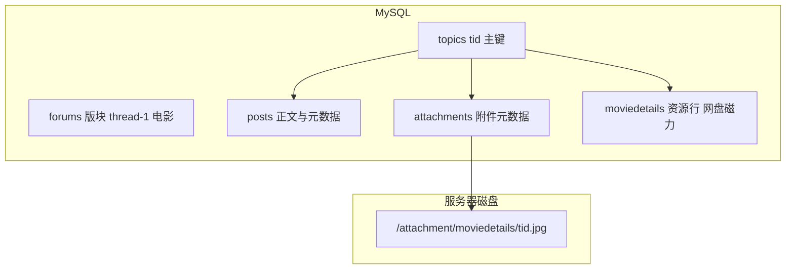
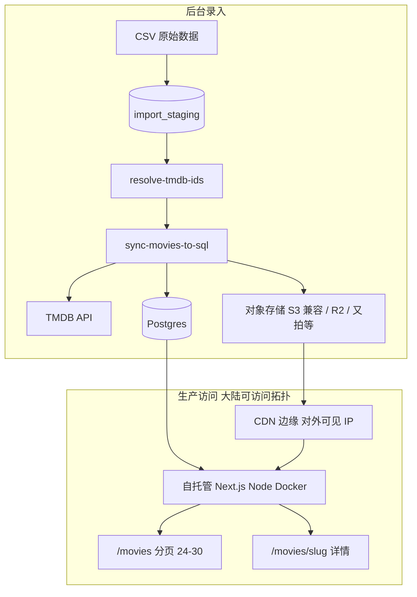
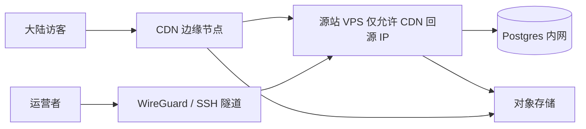
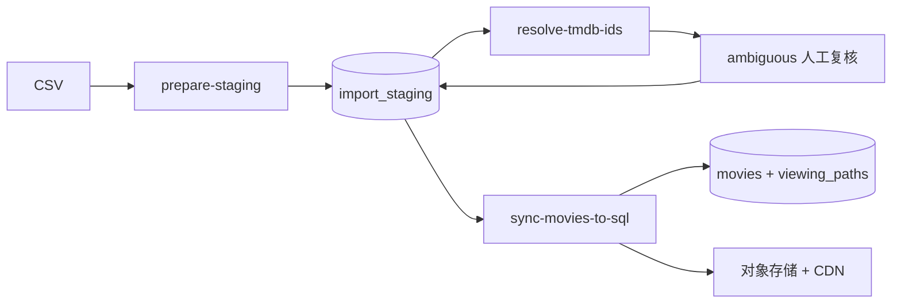

# 万级影视批量录入与 SQL 迁移方案

> 本文档沉淀批量录入 1 万+ 影片、来源链接，以及从当前文件型 MVP 迁移到 PostgreSQL + 对象存储的完整方案。执行前请先阅读并确认范围。可执行动作见 [bulk-ingestion-checklist-v1.md](./bulk-ingestion-checklist-v1.md)。

## 背景与目标

Station Zero 当前使用 `data/movies.json` + `public/media/` 作为电影库 MVP（见 [movie-images.md](./movie-images.md)）。下一步需要：

- **批量录入**约 1 万+ 条影视数据与来源链接（网盘 / 磁力等）
- **原始数据形态**：片名 + 年份 + 链接，**通常没有 `tmdbId`**
- **产品目标**：完整详情页（TMDB 元数据 + 本地化海报 + 人工来源链接）
- **部署目标**：生产环境用 **SQL 管理业务数据**；图片与文本由后台统一维护，前端只读本站数据
- **访问目标**：生产站点需在中国大陆**相对稳定可访问**（Vercel 实测几乎不可用，**不作为生产主机**）
- **隐私目标**：站点与运营链路**不得关联或泄露**运营者个人住址、实名信息、家庭 IP、物理位置等可识别身份的信息

本文档**不包含实现代码**，仅作为决策与实施前的参考基线。

---

## 竞品分析：yqkclub（WMM / 未命名影视）

参考站点：[电影列表](https://www.yqkclub.com/thread-1)、[详情页示例](https://www.yqkclub.com/read-83369398)（2026-06-24 实测）。

### 技术栈推断

| 层级 | 竞品做法 |
|------|---------|
| 后端 | PHP 5.5 + 论坛型 CMS（PHPWind 风格：`wind.js`、`/thread-{fid}`、`/read-{tid}`） |
| 数据库 | **MySQL 关系库**（主题帖 `tid`、版块 `fid`、帖子/附件表） |
| 影片模型 | `moviedetails` 插件：**一个 `tid` = 一部片**；元数据与下载区挂在同一主题 |
| 图片 | **不进数据库 BLOB**；落盘为 `/attachment/moviedetails/{tid}.jpg` |
| CDN | Cloudflare 分发；`cache-control: max-age=16070400`（约 186 天） |
| 前端 | 服务端渲染 HTML；列表/详情均**无** SPA 式影片 JSON API |

### 数据存储结构



- **影片元数据**（导演、演员、类型、简介、IMDb/豆瓣）：来自 DB，SSR 输出到 HTML
- **来源链接**（夸克/百度/迅雷等）：按平台分组，每链一行；含公开/隐藏/待审（UGC 投稿 `app=moviedetails`）
- **海报**：`tid` 作文件名；DB 记附件路径，**二进制在文件系统**

### 页面加载方式

**列表页** `/thread-1`：

- **30 条/页**，PHP 分页 SSR（`/thread-1-2` …）
- 海报懒加载：`data-echo="/attachment/moviedetails/{tid}.jpg"` + 占位 `blank.gif`
- HTML 直接输出标题、更新时间；浏览器**不**拉影片 catalog API
- 老片靠**搜索**（片名 / IMDb）或 `/read-{tid}` 直链

**详情页** `/read-{tid}`：

- 一次 SSR：海报 + 元数据 + 剧情 + 按平台分组的下载 Tab
- 海报直链，约 **26KB JPEG**；`cf-cache-status: HIT`

**规模观察**：

- 全局 `tid` 已达 8300 万+（含电影/剧集/综艺/动漫等历史主题）
- 电影版块列表对访客约 **15 页 × 30 条 ≈ 450 部**近期片；历史库靠搜索与直链
- 万级库的关键是 **SQL 索引 + 分页**，而非一次加载全库

### 对 Station Zero 的启示

| 做法 | 竞品 | Station Zero 应对 |
|------|------|-------------------|
| 元数据与链接 | MySQL 表 + 关系行 | Postgres `movies` + `viewing_paths` |
| 图片 | 文件 + CDN，DB 只存路径 | 路径入库 + 对象存储/CDN |
| 列表 | 30/页 SSR + 懒加载海报 | `/movies` SQL 分页 + `loading="lazy"` |
| 详情 | 单次 SSR 全量 | ISR / 动态 `getMovieBySlug` + JOIN paths |
| 构建 | 无 1 万页 SSG | 不为全库 `generateStaticParams` |
| 录入 | UGC 投稿 + 审核 | 批量 staging + `content_status` 审核流 |

---

## 当前仓库现状与瓶颈

| 能力 | 现状 | 对 1 万+ 的影响 |
|------|------|----------------|
| 数据存储 | `data/movies.json` 整文件读写 | 50–150MB JSON；Git 膨胀 |
| TMDB 搜索 | `scripts/sync-movies.mjs` 只取第一条，**不用 year** | 同名片大量错配 |
| 来源链接 | `viewingPaths[]`；seed 非空时覆盖 TMDB | 必须在录入阶段写入链接 |
| 同步 | 全串行，无限速/断点 | 易限流；中断丢进度 |
| 图片 | `public/media/posters/` 静态文件 | ~2 万张图不宜进 Git |
| 前端 | `getMovies()` 一次读全库；详情页全量 SSG | 构建与内存压力大 |

**结论**：在现有文件 MVP 上直接跑 1 万+ 不可行；应先完成 SQL + 对象存储架构，再跑批量录入。

---

## 目标架构

SQL 管理元数据与链接；图片二进制放对象存储，**DB 存路径与哈希**（与竞品 `/attachment/` + CDN 同族）。



### 与竞品的对齐

| 维度 | yqkclub | Station Zero |
|------|---------|--------------|
| 影片主记录 | `topics.tid` | `movies.id` + `slug` |
| 来源链接 | 多行资源表，按平台分组 | `viewing_paths` 表 |
| 海报 URL | `/attachment/moviedetails/{tid}.jpg` | `movies.poster_url` → CDN |
| 列表 | 30/页 | 24–30/页，`ORDER BY updated_at DESC` |
| 图片体积 | ~26KB JPEG | 同步压 WebP ~50–80KB |
| 缓存 | Cloudflare 长缓存 | `Cache-Control: immutable, max-age=31536000` |

### 技术选型（建议）

> **生产与开发分离**：本地 / CI 仍可用 Vercel Preview 做功能验证；**万级生产流量走自托管 + CDN**，见下文「生产部署：大陆可访问与隐私隔离」。

- **应用运行时（生产）**：境外 VPS 或云主机（香港 / 新加坡 / 日本等）上 **Docker 自托管 Next.js**（`node server.js` 或 `standalone` 输出 + Caddy/Nginx 反代）
- **应用运行时（开发/预览）**：Vercel 或本地 `npm run dev`（不作为大陆生产方案）
- **数据库**：PostgreSQL — 与源站同 VPC / 内网，或托管库 + **IP 白名单**（Neon / Supabase / 自建均可，**禁止对公网 0.0.0.0/0 开放**）
- **ORM / 迁移**：Drizzle + `drizzle-kit`
- **对象存储**：S3 兼容（Cloudflare R2、Backblaze B2、又拍云等），经 CDN 对外发图
- **CDN**：Bunny CDN、Cloudflare（大陆稳定性因线路而异）、或境内 CDN **回源境外**（需单独评估备案与域名策略）
- **环境变量**：`DATABASE_URL`、对象存储密钥、CDN 回源密钥；TMDB 凭证仍仅用于后台脚本

---

## 生产部署：大陆可访问与隐私隔离

### 问题陈述

| 约束 | 说明 |
|------|------|
| Vercel 大陆不可用 | 边缘节点与路由在大陆访问极不稳定，不适合作为生产主机或唯一 CDN |
| 隐私优先 | 域名 WHOIS、服务器账单、站点页脚、备案主体、源站 IP 等均可能反向关联到个人 |
| 内容属性 | 站点含网盘 / 磁力等来源链接，运营者身份暴露的风险权重应高于普通内容站 |

**结论**：生产应采用 **「CDN 对外 + 源站隐藏 + 数据与身份隔离」** 拓扑；购买 VPS / 云服务前先把隐私边界写进架构，而不是事后补救。

### 推荐拓扑（隐私友好 baseline）



要点：

1. **访客只接触 CDN 与对象存储 URL**，不直连源站 IP。
2. **源站防火墙**（`ufw` / 云安全组）：仅放行 CDN 回源 IP 段 + 运营者 VPN/SSH 来源；关闭多余端口。
3. **Postgres 不对公网监听**；若用托管库，仅允许源站 egress IP。
4. **后台录入与 sync 脚本**在源站或 CI 跑，TMDB 出站与访客访问路径分离。

### 部署方案对比（待采购前选型）

| 方案 | 大陆访问稳定性 | 隐私友好度 | 运维复杂度 | 适用阶段 |
|------|----------------|------------|------------|----------|
| **A. 境外 VPS（HK/SG/JP）+ CDN** | 中（取决于线路与 CDN） | **高**（可选低 KYC 服务商） | 中 | **推荐生产 baseline** |
| **B. 境外云主机（阿里云/腾讯云 香港区）** | 中高 | 中（国内账号通常**强实名**） | 中 | 要稳定线路、可接受实名 |
| **C. 个人 VPS 直连，无 CDN** | 低–中 | **低**（源 IP 易暴露、易被扫） | 低 | **不推荐** |
| **D. 境内云 + ICP 备案 + 境内 CDN** | 高 | **低**（备案绑定主体与手机号） | 高 | 与当前隐私目标**冲突大** |
| **E. Vercel + Neon（现状延伸）** | 极低 | 中 | 低 | 仅开发 / 海外受众 |

**倾向建议**：优先 **方案 A** — 境外 VPS + CDN + 对象存储；在 A 稳定后再考虑是否叠加境内 CDN 回源（不默认走备案路线）。

### 隐私隔离清单（实施前逐项确认）

#### 1. 域名与 WHOIS

- 注册商选支持 **WHOIS Privacy / Redaction** 的（如 Cloudflare Registrar、Porkbun、Namecheap 等）。
- 使用 **项目专用邮箱**（别名邮箱即可），不用个人常用邮箱出现在 WHOIS /  abuse 联系里。
- 站点页脚、关于页、错误页：**不出现**真实姓名、住址、个人手机号。

#### 2. 服务器与账单身份

- VPS 账单联系邮箱与域名邮箱**同一项目身份**，与个人日常邮箱分离。
- 若服务商支持，优先选 **KYC 要求低** 的境外 VPS；支付方式评估是否需与个人信用卡强绑定（必要时单独虚拟卡 / 项目卡）。
- **不在站点任何公开资源**中暴露源站 IP、SSH 端口、面板 hostname。

#### 3. 隐藏源站 IP（必做）

- 全站（HTML + 图片）经 **CDN** 出网；源站仅 CDN 回源。
- 配置 **CDN → Origin** 认证（回源 Header 密钥或 mTLS，视 CDN 能力）。
- 源站禁止对 `0.0.0.0/0:443` 开放；仅 CDN IP 段 + 管理 VPN。
- 对象存储 bucket **默认私有**，经 CDN 或 signed URL 对外；避免公开 listing 泄露 bucket 结构。

#### 4. 运营访问路径

- 管理 SSH **禁止密码登录**，仅密钥；密钥专用、不与个人其他服务复用。
- 优先 **WireGuard / Tailscale** 进内网后再连 Postgres / 管理端口，而非 Postgres 公网 + 弱口令。
- 后台 sync 脚本、数据库迁移：**不在**访客可访问的 URL 路径下暴露。

#### 5. 内容与元数据

- Git 提交作者、公开 Issue、站点「关于」页：使用 **项目化名**，不链个人社交主页。
- 图片 EXIF、PDF 附件等上传前 **剥离元数据**（拍摄位置、设备序列号等）。
- 日志：Nginx/Caddy access log 定期轮转；**不**把含访客 IP 的原始日志公开或上传到第三方分析（若用分析，选自托管或隐私友好方案）。

#### 6. 大陆合规边界（与隐私的张力）

- **ICP 备案**在大陆境内托管时通常要求**实名主体**，与「不关联个人信息」目标直接冲突 — 当前方案**默认不走**境内主体备案路线。
- 境外托管 + 无备案.custom 域名在大陆可达性依赖 CDN/线路，**不保证**与竞品同等级别稳定；需在 pilot 阶段实测延迟与可用率。
- 站点内容（来源链接聚合）本身的合规风险独立于技术隐私，产品边界见 [about 页合规说明](../../src/app/about/page.tsx) 与 PRD；本文档只覆盖**基础设施层身份隔离**。

### 对本文档其它章节的修订

| 原假设 | 修订后 |
|--------|--------|
| Vercel 生产 + Neon | 生产改为 **VPS Docker + 内网 Postgres**；Neon 可作 dev/staging |
| Vercel Blob | **S3 兼容对象存储** + CDN 域名 |
| Cloudflare 长缓存 | 保留策略；大陆是否采用 CF 需在 **pilot 实测** 后定 CDN 供应商 |
| 「部署验证 0.5–1 天」 | 增加 **CDN 回源 + 防火墙 + 大陆多地拨测**（见下） |

### 部署相关待办（补充）

| # | 事项 | 产出 |
|---|------|------|
| D1 | 确定生产方案（A/B）与 CDN 供应商 | [mainland-topology.md](./mainland-topology.md)（线路、回源方式） |
| D2 | 注册项目域名 + 开启 WHOIS 隐私 | 域名 + DNS 托管 |
| D3 | 采购 VPS / 云主机，创建**项目专用** SSH 密钥 | 源站 IP（不公开） |
| D4 | 源站：Docker Compose（app + postgres + caddy） | `deploy/` 或 `docker-compose.prod.yml` 草案 |
| D5 | CDN 回源 + 源站防火墙仅放行 CDN IP | 防火墙规则截图 / IaC |
| D6 | 对象存储 bucket + CDN 自定义域名（如 `media.example.com`） | 图片 URL 写入 `movies.poster_url` |
| D7 | 大陆多地访问拨测（手动或第三方） | 延迟 / 可用率记录，决定是否换 CDN 或加境内加速 |
| D8 | 隐私自查：WHOIS、页脚、about、响应头 `Server`、错误页 | checklist 全部勾选 |

### 购买前决策问题（请先回答再下单）

1. **可接受的实名程度**：完全不接受境内强实名 → 锁定方案 A；可接受香港云实名 → 可评估方案 B。
2. **预算区间**：VPS + CDN + 对象存储月费上限（影响是否上境内 CDN 回源）。
3. **域名策略**：`.com` 境外注册即可；若未来考虑 `.cn` 或境内 CDN，需单独评估备案与隐私冲突。
4. **运维投入**：是否接受自行维护 Docker / 证书续期 / 备份（VPS 方案必需）。
5. **备份与恢复**：Postgres 与对象存储的离线备份频率、加密、存放位置（不与源站同账号单点）。

---

## 数据模型草案

### `movies`

对标竞品「主题 + moviedetails 元数据」，并保留 Station Zero 策展字段。

| 列 | 说明 |
|----|------|
| `id` | uuid PK |
| `slug` | 公开 URL 标识，UNIQUE |
| `tmdb_id` | 同步键，nullable |
| `title`, `original_title`, `year` | 展示字段 |
| `genres`, `cast`, `writers`, … | text[] 或 JSONB |
| `summary`, `verdict`, `best_way`, `ideal_scene`, `not_for` | 文本 |
| `poster_url`, `backdrop_url` | CDN 路径 |
| `palette` | JSONB |
| `content_status` | draft / review / published |
| `source_provider` | tmdb / manual |
| `created_at`, `updated_at` | timestamptz |

### `viewing_paths`

对标竞品按平台分组的下载列表；类型与 [`src/lib/content.ts`](../../src/lib/content.ts) 中 `ViewingPath` 一致。

| 列 | 说明 |
|----|------|
| `id` | uuid PK |
| `movie_id` | FK → movies |
| `platform`, `type`, `note` | 必填 |
| `url` | nullable（magnet / 网盘） |
| `visibility` | public / hidden |
| `sort_order` | 展示顺序 |

### `media_assets`

路径入库，**不**在生产表存 BYTEA。

| 列 | 说明 |
|----|------|
| `id` | uuid PK |
| `movie_id` | FK |
| `kind` | poster / backdrop |
| `storage_key` | 如 `posters/playdate.webp` |
| `public_url` | CDN URL |
| `mime_type` | 建议 `image/webp` |
| `byte_size`, `sha1` | 监控与去重 |
| `source_url` | TMDB 原图，便于刷新 |

> 开发阶段若需 BLOB 中转：仅在 `import_staging` 临时存 `bytea`，上传对象存储后删除。

### `import_staging`

批量录入缓冲表。

| 列 | 说明 |
|----|------|
| 原始字段 | title, year, platform, type, note, url |
| `batch_id` | 每批 ~500 条 |
| `tmdb_resolve_status` | pending / resolved / ambiguous / failed |
| `tmdb_id` | 消歧结果 |
| `candidates_json` | 多候选时供人工复核 |

---

## 读取层与页面策略

### 列表 `/movies`

```sql
SELECT ... FROM movies
WHERE content_status = 'published'
ORDER BY updated_at DESC
LIMIT 30 OFFSET ?;
```

- 海报 `loading="lazy"`
- **禁止**一次 `getMovies()` 加载全库

### 详情 `/movies/[slug]`

- `movies` JOIN `viewing_paths` 单次查询
- ISR `revalidate: 86400` 或按需动态
- `generateStaticParams` **仅预热**首页精选 / published Top N（如 50），不对 1 万条 SSG

### 图片同步流水线

1. TMDB 下载原图
2. 压缩 WebP（海报 ~20–80KB）
3. 上传对象存储 → `public_url`
4. 写 `media_assets` + 更新 `movies.poster_url`
5. CDN 长缓存响应头

---

## 批量录入流水线

数据形态：**片名 + 年份 + 链接，无 tmdbId**。



### 步骤 1：`prepare-staging`

- 输入：CSV / JSON Lines
- 按 `(title, year)` 分组；多链接合并为多条 `viewing_paths` 或 staging 多行
- 建议 CSV 列：`title`, `year`, `platform`, `type`, `note`, `url`, `slug`（可选）
- `COPY` 进 `import_staging`，`batch_id` 每 500 条

### 步骤 2：`resolve-tmdb-ids`（不可跳过）

现有 `findTmdbId` 无 year 过滤，万级必错配。新脚本应：

1. 调用 TMDB `/search/movie?query=...&year=...`
2. 年份匹配 → 自动采纳；多候选 → `ambiguous-report.csv`；无结果 → `failed`
3. `--concurrency 3`、`--delay-ms 250`、每 50 条 checkpoint、`--resume`

预期：~85–92% 自动解析，~5–10% 人工，~3–5% TMDB 无条目走 manual。

### 步骤 3：`sync-movies-to-sql`

| 保留 | 写入 |
|------|------|
| TMDB detail | `movies` UPSERT（`ON CONFLICT slug`） |
| staging 链接优先 | `viewing_paths` 批量 INSERT |
| 图片 | 压缩 → 对象存储 → `poster_url` |
| palette | `movies.palette` JSONB |
| 限速 / 断点 | 每 N 条提交事务；失败写 `sync_failures` |

**链接优先级**（与现 `sync-movies.mjs` 一致）：staging / seed 中 `viewingPaths` 非空时，**不**被 TMDB 正版路径覆盖。

### 步骤 4：发布

- 默认 `content_status = draft`
- 抽检通过后批量 `published`

---

## 与文件 MVP 的过渡顺序

| 顺序 | 动作 |
|------|------|
| 1 | Schema + `movies.json` → SQL + 海报上传 Supabase Storage |
| 2 | `movie-store` 改读 SQL；列表分页 + 懒加载 |
| 3 | 100 条 pilot 端到端 |
| 4 | 全量 1 万+ 分批录入 |
| 5 | `data/movies.json` 降为导出备份；`DATABASE_URL` 缺失时可保留 JSON fallback |

**不建议**：先增强 JSON 断点写入再迁 SQL（双倍工作）。

---

## 实施优先级

1. **生产部署选型 + 隐私边界确认**（D1–D3，见「生产部署：大陆可访问与隐私隔离」）
2. Postgres schema + Drizzle migrations
3. 对象存储 + CDN 发图（D6）
4. 源站 Docker 化 + CDN 回源与防火墙（D4–D5）
5. `movie-store` 分页读取 + 列表懒加载
6. `sync-movies-to-sql` + staging
7. `resolve-tmdb-ids`
8. `prepare-staging`
9. 构建策略（published ISR，不全量 SSG）
10. 大陆拨测与 CDN 调优（D7–D8）

---

## 已实现脚本（`scripts/bulk-ingest/`）

| 脚本 | npm 命令 | 职责 |
|------|----------|------|
| `clean-import-txt.mjs` | （手动 `node`） | 原始 TXT → `movies-clean.csv` |
| `prepare-staging.mts` | `npm run ingest:staging` | CSV → `import_staging` |
| `resolve-tmdb-ids.mts` | `npm run ingest:resolve` | TMDB 年份消歧 + 复核报告 |
| `resolve-ambiguous.mts` | `npm run ingest:resolve-ambiguous` | ambiguous 自动 / 半自动消歧 |
| `resolve-failed.mts` | `npm run ingest:resolve-failed` | failed 重试（中文片名 + 年份容差） |
| `sync-movies-to-sql.mts` | `npm run ingest:sync` | SQL UPSERT + w500 海报压缩 WebP → Storage |
| `upload-media-to-storage.mts` | `npm run ingest:upload-media` | 本地海报补传 Storage |
| `compress-image.mts` | （模块） | sharp resize + WebP |
| `run-pilot-ingest.mts` | `npm run ingest:pilot` | 一键 Pilot（默认 100 部） |
| `scripts/legacy/migrate-json-to-sql.mts` | `npm run db:migrate:json` | 一次性迁移 `movies.json` → SQL |

索引与命令表见 [scripts/index.md](../../scripts/index.md)、[bulk-ingestion-runbook.md](./bulk-ingestion-runbook.md)。

过渡期 legacy 命令仍可用：`npm run sync:movies`、`npm run import:movies`（写入 JSON，非万级录入终点）。

---

## 时间预期

| 环节 | 耗时（粗估） |
|------|-------------|
| 部署选型 + VPS/CDN 采购与基线 hardened | 1–2 天 |
| DB + 对象存储 + 读取层 | 3–5 天 |
| Docker 生产编排 + CDN 回源/firewall | 1–2 天 |
| prepare + resolve + sync 脚本 | 2–3 天 |
| 100 条 pilot | 0.5–1 天 |
| 全量 1 万+ | 2–4 天 |
| 部署验证 + 大陆拨测 | 1–2 天 |
| **合计** | **约 10–17 个工作日** |

---

## 风险与对策

| 风险 | 对策 |
|------|------|
| Vercel / 默认境外 CDN 在大陆不可用 | 生产改自托管 VPS + 可换 CDN；pilot 阶段大陆拨测 |
| 源站 IP 泄露导致人肉 / 攻击 | CDN 前置 + 防火墙仅放行回源 IP；禁止直连部署 |
| 域名 / 账单 / 备案关联个人身份 | WHOIS 隐私、项目专用邮箱与支付、默认不走 ICP 备案 |
| 图片 BYTEA 导致库膨胀、Serverless 慢 | 路径在 SQL，二进制在对象存储 + CDN |
| 列表一次加载全库 | SQL 分页 + 懒加载 |
| 1 万页 SSG 构建爆炸 | 仅 published Top N 预热；生产用 ISR/动态而非全量 SSG |
| TMDB 限流 | 分批 + 限速 + 429 退避 |
| 同名片错配 | year 消歧 + ambiguous 人工队列 |
| 链接被 TMDB 覆盖 | staging `viewing_paths` 优先 |

---

## 试点建议

先 **100 条端到端**：`CSV → staging → resolve → sync → SQL 分页列表 + CDN 海报 + 详情页链接分组`，并在**大陆网络环境下**验证列表/详情/图片加载，统计错配率、单条耗时与可用率，再放大全量。

---

## 相关文档

- [movie-images.md](./movie-images.md) — 当前文件型 MVP 与图片策略
- [station-zero-prd-v0.1.md](../product/station-zero-prd-v0.1.md) — 产品方向基线
- [AGENTS.md](../../AGENTS.md) — 仓库开发与录入约定
