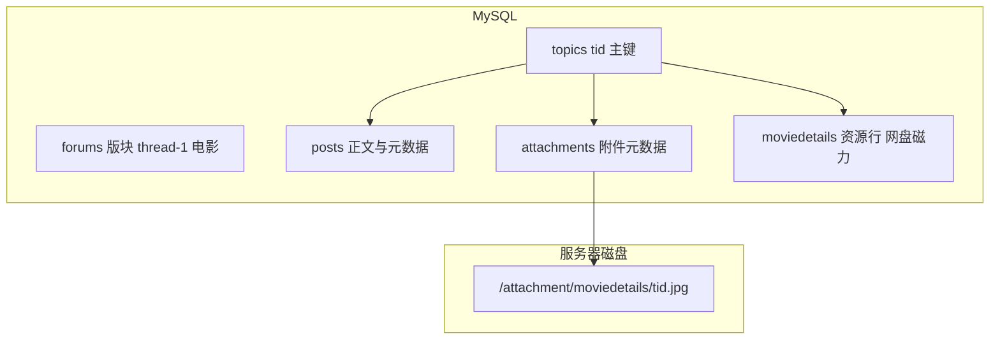
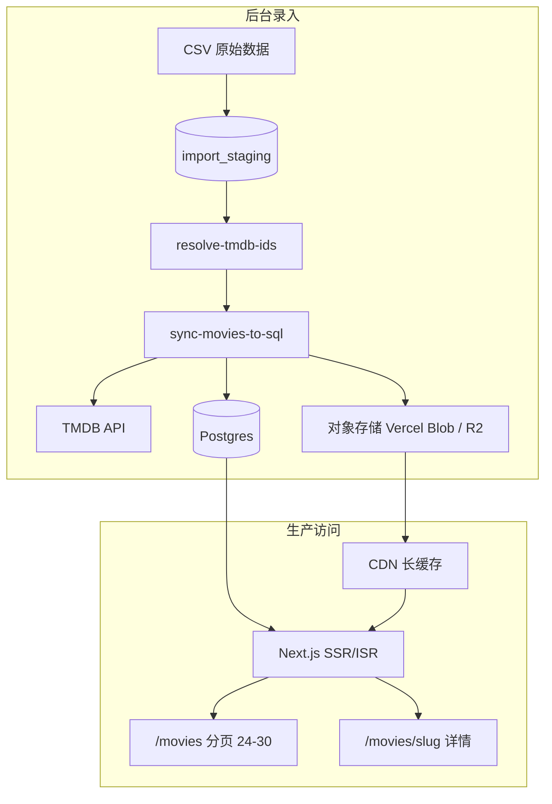
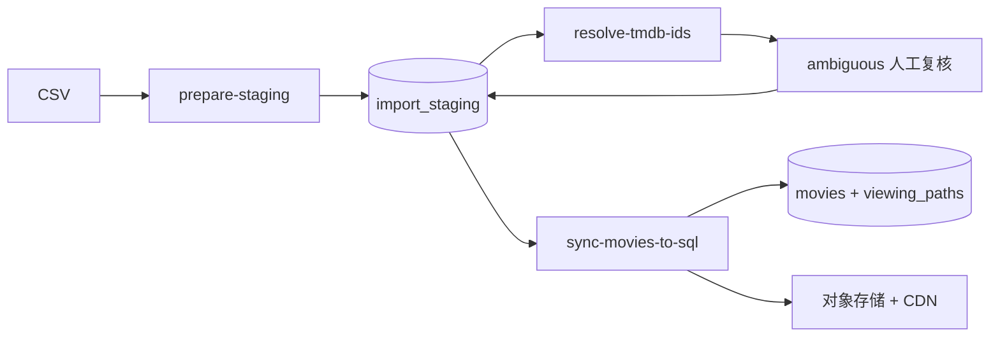

# 万级影视批量录入与 SQL 迁移方案

> **状态：规划中，尚未实施**（2026-06-24）
>
> 本文档沉淀批量录入 1 万+ 影片、来源链接，以及从当前文件型 MVP 迁移到 PostgreSQL + 对象存储的完整方案。执行前请先阅读并确认范围。

## 背景与目标

Station Zero 当前使用 `data/movies.json` + `public/media/` 作为电影库 MVP（见 [movie-image-ingestion-and-cache.md](./movie-image-ingestion-and-cache.md)）。下一步需要：

- **批量录入**约 1 万+ 条影视数据与来源链接（网盘 / 磁力等）
- **原始数据形态**：片名 + 年份 + 链接，**通常没有 `tmdbId`**
- **产品目标**：完整详情页（TMDB 元数据 + 本地化海报 + 人工来源链接）
- **部署目标**：生产环境用 **SQL 管理业务数据**；图片与文本由后台统一维护，前端只读本站数据

本文档**不包含实现代码**，仅作为决策与实施前的参考基线。

---

## 竞品分析：yqkclub（WMM / 未命名影视）

参考站点：[电影列表](https://www.yqkclub.com/thread-1)、[详情页示例](https://www.yqkclub.com/read-83369398)（2026-06-24 实测）。

### 技术栈推断

| 层级 | 竞品做法 |
|------|---------|
| 后端 | PHP 5.5 + 论坛型 CMS（PHPWind 风格：`wind.js`、`/thread-{fid}`、`/read-{tid}`） |
| 数据库 | **MySQL 关系库**（主题帖 `tid`、版块 `fid`、帖子/附件表） |
| 影片模型 | `moviedetails` 插件：**一个 `tid` = 一部片**；元数据与下载区挂在同一主题 |
| 图片 | **不进数据库 BLOB**；落盘为 `/attachment/moviedetails/{tid}.jpg` |
| CDN | Cloudflare 分发；`cache-control: max-age=16070400`（约 186 天） |
| 前端 | 服务端渲染 HTML；列表/详情均**无** SPA 式影片 JSON API |

### 数据存储结构



- **影片元数据**（导演、演员、类型、简介、IMDb/豆瓣）：来自 DB，SSR 输出到 HTML
- **来源链接**（夸克/百度/迅雷等）：按平台分组，每链一行；含公开/隐藏/待审（UGC 投稿 `app=moviedetails`）
- **海报**：`tid` 作文件名；DB 记附件路径，**二进制在文件系统**

### 页面加载方式

**列表页** `/thread-1`：

- **30 条/页**，PHP 分页 SSR（`/thread-1-2` …）
- 海报懒加载：`data-echo="/attachment/moviedetails/{tid}.jpg"` + 占位 `blank.gif`
- HTML 直接输出标题、更新时间；浏览器**不**拉影片 catalog API
- 老片靠**搜索**（片名 / IMDb）或 `/read-{tid}` 直链

**详情页** `/read-{tid}`：

- 一次 SSR：海报 + 元数据 + 剧情 + 按平台分组的下载 Tab
- 海报直链，约 **26KB JPEG**；`cf-cache-status: HIT`

**规模观察**：

- 全局 `tid` 已达 8300 万+（含电影/剧集/综艺/动漫等历史主题）
- 电影版块列表对访客约 **15 页 × 30 条 ≈ 450 部**近期片；历史库靠搜索与直链
- 万级库的关键是 **SQL 索引 + 分页**，而非一次加载全库

### 对 Station Zero 的启示

| 做法 | 竞品 | Station Zero 应对 |
|------|------|-------------------|
| 元数据与链接 | MySQL 表 + 关系行 | Postgres `movies` + `viewing_paths` |
| 图片 | 文件 + CDN，DB 只存路径 | 路径入库 + 对象存储/CDN |
| 列表 | 30/页 SSR + 懒加载海报 | `/movies` SQL 分页 + `loading="lazy"` |
| 详情 | 单次 SSR 全量 | ISR / 动态 `getMovieBySlug` + JOIN paths |
| 构建 | 无 1 万页 SSG | 不为全库 `generateStaticParams` |
| 录入 | UGC 投稿 + 审核 | 批量 staging + `content_status` 审核流 |

---

## 当前仓库现状与瓶颈

| 能力 | 现状 | 对 1 万+ 的影响 |
|------|------|----------------|
| 数据存储 | `data/movies.json` 整文件读写 | 50–150MB JSON；Git 膨胀 |
| TMDB 搜索 | `scripts/sync-movies.mjs` 只取第一条，**不用 year** | 同名片大量错配 |
| 来源链接 | `viewingPaths[]`；seed 非空时覆盖 TMDB | 必须在录入阶段写入链接 |
| 同步 | 全串行，无限速/断点 | 易限流；中断丢进度 |
| 图片 | `public/media/posters/` 静态文件 | ~2 万张图不宜进 Git |
| 前端 | `getMovies()` 一次读全库；详情页全量 SSG | 构建与内存压力大 |

**结论**：在现有文件 MVP 上直接跑 1 万+ 不可行；应先完成 SQL + 对象存储架构，再跑批量录入。

---

## 目标架构

SQL 管理元数据与链接；图片二进制放对象存储，**DB 存路径与哈希**（与竞品 `/attachment/` + CDN 同族）。



### 与竞品的对齐

| 维度 | yqkclub | Station Zero |
|------|---------|--------------|
| 影片主记录 | `topics.tid` | `movies.id` + `slug` |
| 来源链接 | 多行资源表，按平台分组 | `viewing_paths` 表 |
| 海报 URL | `/attachment/moviedetails/{tid}.jpg` | `movies.poster_url` → CDN |
| 列表 | 30/页 | 24–30/页，`ORDER BY updated_at DESC` |
| 图片体积 | ~26KB JPEG | 同步压 WebP ~50–80KB |
| 缓存 | Cloudflare 长缓存 | `Cache-Control: immutable, max-age=31536000` |

### 技术选型（建议）

- **数据库**：PostgreSQL（Neon / Supabase，配 Vercel）
- **ORM / 迁移**：Drizzle + `drizzle-kit`
- **对象存储**：Vercel Blob 或 Cloudflare R2
- **环境变量**：`DATABASE_URL`；TMDB 凭证仍仅用于后台脚本

---

## 数据模型草案

### `movies`

对标竞品「主题 + moviedetails 元数据」，并保留 Station Zero 策展字段。

| 列 | 说明 |
|----|------|
| `id` | uuid PK |
| `slug` | 公开 URL 标识，UNIQUE |
| `tmdb_id` | 同步键，nullable |
| `title`, `original_title`, `year` | 展示字段 |
| `genres`, `cast`, `writers`, … | text[] 或 JSONB |
| `summary`, `verdict`, `best_way`, `ideal_scene`, `not_for` | 文本 |
| `poster_url`, `backdrop_url` | CDN 路径 |
| `palette` | JSONB |
| `content_status` | draft / review / published |
| `source_provider` | tmdb / manual |
| `created_at`, `updated_at` | timestamptz |

### `viewing_paths`

对标竞品按平台分组的下载列表；类型与 [`src/lib/content.ts`](../../src/lib/content.ts) 中 `ViewingPath` 一致。

| 列 | 说明 |
|----|------|
| `id` | uuid PK |
| `movie_id` | FK → movies |
| `platform`, `type`, `note` | 必填 |
| `url` | nullable（magnet / 网盘） |
| `visibility` | public / hidden |
| `sort_order` | 展示顺序 |

### `media_assets`

路径入库，**不**在生产表存 BYTEA。

| 列 | 说明 |
|----|------|
| `id` | uuid PK |
| `movie_id` | FK |
| `kind` | poster / backdrop |
| `storage_key` | 如 `posters/playdate.webp` |
| `public_url` | CDN URL |
| `mime_type` | 建议 `image/webp` |
| `byte_size`, `sha1` | 监控与去重 |
| `source_url` | TMDB 原图，便于刷新 |

> 开发阶段若需 BLOB 中转：仅在 `import_staging` 临时存 `bytea`，上传对象存储后删除。

### `import_staging`

批量录入缓冲表。

| 列 | 说明 |
|----|------|
| 原始字段 | title, year, platform, type, note, url |
| `batch_id` | 每批 ~500 条 |
| `tmdb_resolve_status` | pending / resolved / ambiguous / failed |
| `tmdb_id` | 消歧结果 |
| `candidates_json` | 多候选时供人工复核 |

---

## 读取层与页面策略

### 列表 `/movies`

```sql
SELECT ... FROM movies
WHERE content_status = 'published'
ORDER BY updated_at DESC
LIMIT 30 OFFSET ?;
```

- 海报 `loading="lazy"`
- **禁止**一次 `getMovies()` 加载全库

### 详情 `/movies/[slug]`

- `movies` JOIN `viewing_paths` 单次查询
- ISR `revalidate: 86400` 或按需动态
- `generateStaticParams` **仅预热**首页精选 / published Top N（如 50），不对 1 万条 SSG

### 图片同步流水线

1. TMDB 下载原图
2. 压缩 WebP（海报 ~20–80KB）
3. 上传对象存储 → `public_url`
4. 写 `media_assets` + 更新 `movies.poster_url`
5. CDN 长缓存响应头

---

## 批量录入流水线

数据形态：**片名 + 年份 + 链接，无 tmdbId**。



### 步骤 1：`prepare-staging`

- 输入：CSV / JSON Lines
- 按 `(title, year)` 分组；多链接合并为多条 `viewing_paths` 或 staging 多行
- 建议 CSV 列：`title`, `year`, `platform`, `type`, `note`, `url`, `slug`（可选）
- `COPY` 进 `import_staging`，`batch_id` 每 500 条

### 步骤 2：`resolve-tmdb-ids`（不可跳过）

现有 `findTmdbId` 无 year 过滤，万级必错配。新脚本应：

1. 调用 TMDB `/search/movie?query=...&year=...`
2. 年份匹配 → 自动采纳；多候选 → `ambiguous-report.csv`；无结果 → `failed`
3. `--concurrency 3`、`--delay-ms 250`、每 50 条 checkpoint、`--resume`

预期：~85–92% 自动解析，~5–10% 人工，~3–5% TMDB 无条目走 manual。

### 步骤 3：`sync-movies-to-sql`

| 保留 | 写入 |
|------|------|
| TMDB detail | `movies` UPSERT（`ON CONFLICT slug`） |
| staging 链接优先 | `viewing_paths` 批量 INSERT |
| 图片 | 压缩 → 对象存储 → `poster_url` |
| palette | `movies.palette` JSONB |
| 限速 / 断点 | 每 N 条提交事务；失败写 `sync_failures` |

**链接优先级**（与现 `sync-movies.mjs` 一致）：staging / seed 中 `viewingPaths` 非空时，**不**被 TMDB 正版路径覆盖。

### 步骤 4：发布

- 默认 `content_status = draft`
- 抽检通过后批量 `published`

---

## 与文件 MVP 的过渡顺序

| 顺序 | 动作 |
|------|------|
| 1 | Schema + 迁移现有 ~16 条 `movies.json` → SQL + 海报上传对象存储 |
| 2 | `movie-store` 改读 SQL；列表分页 + 懒加载 |
| 3 | 100 条 pilot 端到端 |
| 4 | 全量 1 万+ 分批录入 |
| 5 | `data/movies.json` 降为导出备份；`DATABASE_URL` 缺失时可保留 JSON fallback |

**不建议**：先增强 JSON 断点写入再迁 SQL（双倍工作）。

---

## 实施优先级

1. Postgres schema + Drizzle migrations
2. 对象存储 + CDN 发图
3. `movie-store` 分页读取 + 列表懒加载
4. `sync-movies-to-sql` + staging
5. `resolve-tmdb-ids`
6. `prepare-staging`
7. 构建策略（published ISR，不全量 SSG）

---

## 待实现脚本（规划）

| 脚本 | 职责 |
|------|------|
| `scripts/prepare-staging.mjs` | CSV → `import_staging` |
| `scripts/resolve-tmdb-ids.mjs` | TMDB year 消歧 + 复核报告 |
| `scripts/sync-movies-to-sql.mjs` | 改造 sync sink：SQL + 对象存储 |
| `scripts/migrate-json-to-sql.mjs` | 一次性迁移现有 `movies.json` |

现有命令在过渡期仍可用：`npm run sync:movies`、`npm run import:movies`（写入 JSON，非本方案终点）。

---

## 时间预期

| 环节 | 耗时（粗估） |
|------|-------------|
| DB + 对象存储 + 读取层 | 3–5 天 |
| prepare + resolve + sync 脚本 | 2–3 天 |
| 100 条 pilot | 0.5–1 天 |
| 全量 1 万+ | 2–4 天 |
| 部署验证 | 0.5–1 天 |
| **合计** | **约 8–14 个工作日** |

---

## 风险与对策

| 风险 | 对策 |
|------|------|
| 图片 BYTEA 导致库膨胀、Serverless 慢 | 路径在 SQL，二进制在对象存储 + CDN |
| 列表一次加载全库 | SQL 分页 + 懒加载 |
| 1 万页 SSG 构建爆炸 | 仅 published Top N 预热 |
| TMDB 限流 | 分批 + 限速 + 429 退避 |
| 同名片错配 | year 消歧 + ambiguous 人工队列 |
| 链接被 TMDB 覆盖 | staging `viewing_paths` 优先 |

---

## 试点建议

先 **100 条端到端**：`CSV → staging → resolve → sync → SQL 分页列表 + CDN 海报 + 详情页链接分组`，统计错配率与单条耗时，再放大全量。

---

## 相关文档

- [movie-image-ingestion-and-cache.md](./movie-image-ingestion-and-cache.md) — 当前文件型 MVP 与图片策略
- [station-zero-prd-v0.1.md](../product/station-zero-prd-v0.1.md) — 产品方向基线
- [AGENTS.md](../../AGENTS.md) — 仓库开发与录入约定
