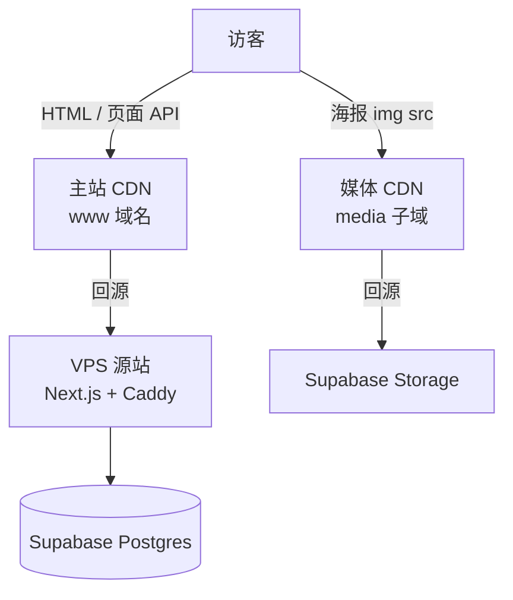

# CDN 回源与源站配置指南

> 对应 [mainland-topology.md](./mainland-topology.md) 任务 **D1**、Phase 6 **G1–G2**。本文说明 **CDN 回源的技术逻辑**、Station Zero 的双链路拓扑，以及 **Cloudflare** 试点配置步骤。VPS / CDN 供应商选型见 `mainland-topology.md`；海报与 Storage 策略见 [movie-images.md](./movie-images.md)。

## 背景

Station Zero 生产环境采用 **境外 VPS 自托管 Next.js**，经 **CDN 对大陆出网**；Supabase 仅作数据层，浏览器不直连 Postgres。Vercel 在大陆实测几乎不可用，不作生产主机。

在此架构下，「CDN 回源源站」指：**访客只访问 CDN 边缘，边缘在缓存未命中时向 VPS 上的应用发起 HTTP 请求取回 HTML / API**。源站 IP 不写入公开 DNS，并配合防火墙与回源鉴权隐藏。

---

## 核心概念

| 术语 | 含义 |
|------|------|
| **源站（Origin）** | 真正运行应用的服务器——VPS 上的 Next.js + Caddy（或 Nginx） |
| **边缘节点（Edge / PoP）** | CDN 在各地部署的缓存服务器，离访客更近 |
| **回源（Origin Pull）** | 边缘无缓存或缓存过期时，CDN **主动向源站请求**内容 |
| **缓存命中（Cache Hit）** | 边缘已有副本，直接返回，**不回源** |
| **缓存未命中（Cache Miss）** | 边缘无副本，**回源**一次后写入边缘缓存再返回 |

---

## 请求时序（主站 HTML）

```text
用户浏览器
    │  GET https://www.example.com/
    ▼
CDN 边缘（就近 PoP，如香港）
    │
    ├─ 边缘有缓存？ ──是──► 直接返回（VPS 无请求）
    │
    └─ 否 / 已过期 ──► 回源 GET https://<源站主机名>/
                          │
                          ▼
                    VPS: Caddy → Next.js
                          │ 经 DATABASE_URL 查 Supabase
                          ▼
                    返回 HTML + Cache-Control
                          │
                          ▼
                    CDN 缓存一份 → 返回用户
```

要点：

- 用户只见 `www.example.com`（解析到 CDN），**不知道 VPS 真实 IP**。
- VPS 主要在 **cache miss**、ISR 再验证、不可缓存 API 时承担算力。
- 源站线路无需 CN2 GIA 等大陆优化——访客不直连 VPS；大陆体感主要由 **CDN PoP** 决定。

---

## Station Zero 双链路拓扑

本站资源分两条 CDN 链路，勿混为一谈：



| 资源类型 | 回源目标 | 缓存策略 |
|----------|----------|----------|
| HTML、页面 API | **VPS**（Next.js） | 短缓存或 `private`；详情页 ISR `revalidate = 86400` |
| 海报、背景图 | **Supabase Storage**（经 `media.` 子域） | `Cache-Control: public, max-age=31536000, immutable` |

海报 URL 存于 `movies.poster_url`，指向 Storage 公网地址；`public/media/` 仅为脚本本地缓存，生产页面以 DB 字段为准。见 [movie-images.md](./movie-images.md)。

---

## 为何采用 CDN 回源

| 目标 | 机制 |
|------|------|
| 大陆相对稳定可访问 | 访客连接 CDN 边缘，而非直连境外 VPS |
| 隐藏源站 IP | 公开 DNS 指向 CDN；扫描公网 IP 打不到真源 |
| 削峰 | 可缓存内容在边缘消化，VPS 只处理动态与未命中 |
| 身份隔离 | 公开入口为 CDN 域名；源站仅 CDN 与管理 VPN 可达 |

### 源站隐藏三件套

1. 域名 **A/CNAME 指 CDN**，不指 VPS IP。
2. 防火墙 **仅放行 CDN 回源 IP 段** + 管理 VPN（Tailscale / WireGuard）。
3. **回源鉴权**（Header 密钥、mTLS 或 Cloudflare Tunnel）。

---

## 回源方式选型

与 [mainland-topology.md](./mainland-topology.md) 对齐：

| 方式 | 做法 | 源站配置 | 倾向 |
|------|------|----------|------|
| **A. 回源 Header 密钥** | CDN 回源时带 `X-Origin-Auth: <secret>` | Caddy/Nginx 校验 Header，不匹配 403 | 推荐起步，理解回源最直观 |
| **B. Authenticated Origin Pulls** | Cloudflare 客户端证书，源站校验 CF 证书 | 仅 Cloudflare | 安全强度高，配置稍繁 |
| **C. IP 白名单** | 源站只接受 CDN 公布的回源 IP 段 | `ufw` / 安全组，需定期同步 IP 列表 | 与 A/B 叠加使用 |
| **D. Cloudflare Tunnel** | 源站无公网 443，主动连 CF | `cloudflared` 指向 `localhost:3000` | **隐私优先时最省事**，IP 不暴露 |

---

## 配置指南：Cloudflare Tunnel（方案 D）

适合试点与匿名优先场景：VPS **无需对公网开放 443**。

### 1. VPS 部署应用

```bash
# 示例：Docker 跑 Next.js standalone，监听本机 3000
docker compose -f docker-compose.prod.yml up -d
```

环境变量 `DATABASE_URL` 仅写在 VPS 或 compose 中，勿暴露给浏览器。

### 2. 安装 cloudflared

```bash
# Ubuntu 示例
curl -L https://github.com/cloudflare/cloudflared/releases/latest/download/cloudflared-linux-amd64.deb -o cloudflared.deb
sudo dpkg -i cloudflared.deb
cloudflared tunnel login
cloudflared tunnel create station-zero
```

### 3. 隧道配置

文件路径示例：`~/.cloudflared/config.yml`

```yaml
tunnel: <TUNNEL_ID>
credentials-file: /root/.cloudflared/<TUNNEL_ID>.json

ingress:
  - hostname: www.example.com
    service: http://localhost:3000
  - hostname: example.com
    service: http://localhost:3000
  - service: http_status:404
```

### 4. DNS（Cloudflare 面板）

| 记录 | 类型 | 值 | 代理 |
|------|------|-----|------|
| `www` | CNAME | `<TUNNEL_ID>.cfargotunnel.com` | Proxied（橙云） |
| `@` | CNAME | `<TUNNEL_ID>.cfargotunnel.com` | Proxied |

### 5. 常驻运行

```bash
cloudflared tunnel run station-zero
# 生产环境建议配置 systemd unit
```

效果：访客 → CF 边缘 → 隧道 → VPS `localhost:3000`；源站可无公网 IP。

---

## 配置指南：传统回源 + Header 鉴权（方案 A）

适合需自建 Caddy/Nginx、完全掌控反代的场景。

### 架构

```text
www.example.com     → Cloudflare Proxied（橙云）
origin.example.com  → A 记录指向 VPS IP（灰云，仅作回源主机名）
```

### 1. Cloudflare SSL

- 加密模式：**Full (strict)**
- 源站安装 **Origin Certificate**（SSL → Origin Server），配置于 Caddy

### 2. 回源 Header（Transform Rules）

Cloudflare → **Rules** → **Transform Rules** → **Modify Request Header**：

```text
When:  Host equals www.example.com
Then:  Set static header  X-Origin-Auth: <随机长密钥>
```

### 3. Caddy 校验示例

```caddyfile
(origin_auth) {
    @bad not header X-Origin-Auth <与上一致的长密钥>
    respond @bad 403
}

www.example.com {
    import origin_auth
    tls /path/to/origin.pem /path/to/origin-key.pem
    reverse_proxy localhost:3000
}
```

### 4. 防火墙（ufw 示例）

```bash
sudo ufw default deny incoming
# SSH 仅 Tailscale 网段（示例）
sudo ufw allow from 100.64.0.0/10 to any port 22
# 443 仅允许 Cloudflare IP 段 — 见 https://www.cloudflare.com/ips/
sudo ufw enable
```

直连 VPS IP 且 Header 不正确 → 403；仅 CDN 回源可通过。

---

## 媒体子域：海报 CDN

海报不经 VPS 回源，单独配置 `media.example.com`：

```text
media.example.com  CNAME  <project>.supabase.co   （Cloudflare Proxied）
```

或使用 Bunny CDN Pull Zone，Origin 填 Storage 公网 URL。

缓存头（与 `next.config.ts` 中 `/media` 及 Storage 策略一致）：

```http
Cache-Control: public, max-age=31536000, immutable
```

---

## 缓存与 Next.js 行为

回源频率由 **Cache-Control** 与 Next.js 渲染策略共同决定：

| 页面 / 路径 | 项目现状 | CDN 建议 |
|-------------|----------|----------|
| 首页 / 列表 | Server Component，数据来自 `movie-api` | HTML 短 TTL 或 Bypass；避免错误长期缓存动态列表 |
| 详情 `/movies/[slug]` | Top 50 SSG + 其余 ISR `revalidate = 86400` | 可 Cache Everything，Edge TTL 对齐 revalidate |
| `/_next/static/*` | 构建产物带 hash | Cache Everything，长 TTL |
| `/api/*` | 动态 API | **Bypass cache** |

Cloudflare：**Caching** → **Cache Rules** 示例：

```text
/api/*              → Bypass cache
/_next/static/*     → Cache Everything, Edge TTL 1 month
```

验证： `curl -I https://www.example.com` 查看响应头 `cf-cache-status: HIT | MISS | BYPASS`。

---

## 上线检查清单

- [ ] `www` 域名橙云 Proxied，公开 DNS **无** 指向 VPS IP 的 A 记录
- [ ] 回源方式已启用：Tunnel **或** Header 鉴权 +（可选）IP 白名单
- [ ] 源站 SSL 与 CF 加密模式为 Full (strict)
- [ ] `DATABASE_URL` 仅在 VPS 环境变量；Supabase pooler 限制 VPS egress IP
- [ ] `media.` 子域指向 Storage，长缓存已生效
- [ ] SSH 仅 VPN / Tailscale；禁止密码登录
- [ ] 响应头不泄露 `Server` / `X-Powered-By` 栈信息
- [ ] 电信 / 联通 / 移动三地拨测 TTFB 与可用率（见 `mainland-topology.md` Pilot 表）

---

## 与 VPS 选型的关系

| 误解 | 说明 |
|------|------|
| 源站要买 CN2 GIA | 访客走 CDN，不回源线路不决定公开访问速度 |
| 源站要大带宽 | 图片走 Storage + `media.` CDN；VPS 主要出 HTML |
| 源站要大硬盘 | 海报不在 VPS；40–80 GB 足够 Docker + 日志 |

推荐源站规格：**2C4G 起**（试点可 2C2G，构建放 CI 不在 VPS 上执行 `npm run build`）。VPS 商家与区域见 [mainland-topology.md](./mainland-topology.md)。

---

## 最小可行试点路径

```text
1. VPS（HK）：Docker 跑 Next.js standalone（2G+ 内存）
2. Cloudflare：域名 NS 迁入，Tunnel 指向 localhost:3000
3. Supabase：配置 DATABASE_URL；pooler 白名单加 VPS egress IP
4. media 子域 → Supabase Storage + 长缓存
5. 三地拨测；不达标时先调 CDN，再考虑换 VPS 区域
```

---

## 相关文档

- [mainland-topology.md](./mainland-topology.md) — CDN / VPS 供应商对比、回源方式决策表、防火墙与拨测
- [movie-images.md](./movie-images.md) — 海报 URL、Storage、CDN 缓存策略
- [bulk-ingestion-scheme.md](./bulk-ingestion-scheme.md) — 生产部署与隐私隔离总方案
- [bulk-ingestion-checklist-v1.md](./bulk-ingestion-checklist-v1.md) — Phase 6 部署勾选（G1–G5）
