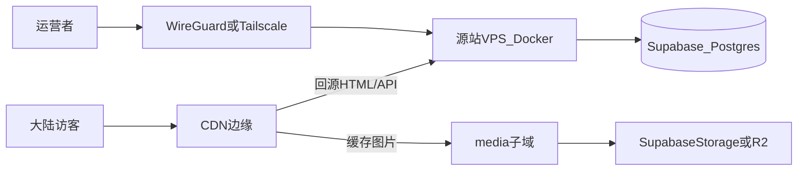

# 大陆拓扑选型记录（一页）

> 对应 [bulk-ingestion-scheme.md](./bulk-ingestion-scheme.md) 任务 **D1** 与 [bulk-ingestion-checklist-v1.md](./bulk-ingestion-checklist-v1.md) **D1**。锁定方案 A：**境外 VPS + CDN 回源 + 源站隐藏**；Supabase 仅数据层，不经 CDN 对访客暴露。

## 锁定拓扑

| 层级 | 选型 | 对外可见 |
|------|------|----------|
| 公众入口 | CDN（DNS NS 托管在 CDN） | 是 |
| 应用 | 境外 VPS，Docker 跑 Next.js standalone + Caddy | **否**（仅 CDN 回源 IP 可达） |
| 数据 | Supabase Postgres + Storage | **否**（仅 VPS IP / pooler 白名单） |
| 管理 | VPN → SSH，禁密码登录 | 否 |

**源站隐藏三件套：** ① 域名 A/CNAME 指 CDN，不指 VPS IP；② 防火墙仅放行 CDN 回源 IP 段 + 管理 VPN；③ 回源鉴权（Header 密钥或 mTLS）。

---

## VPS 区域（源站）

| 区域 | 大陆延迟粗感 | 隐私/KYC | 建议 |
|------|--------------|----------|------|
| **香港 HK** | 低–中 | 视商家（低 KYC VPS 可选） | **首选试点** |
| **新加坡 SG** | 中 | 同上 | 备选，国际带宽稳 |
| **日本 JP** | 中 | 同上 | 备选，晚高峰视线路 |

| 商家类型 | 代表 | 大陆线路 | 隐私 | 备注 |
|----------|------|----------|------|------|
| 低 KYC 境外 VPS | Bandwagon、DMIT、Akile 等 | 因套餐而异（CN2 GIA / CMI 等） | 较高 | 看是否接受支付宝/实名 |
| 港云（强实名） | 阿里云/腾讯云 HK | 较稳 | 低 | 与隐私目标冲突，不默认 |

**本项决策（填写）：**

- [ ] VPS 商家：`____________`
- [ ] 区域：`HK` / `SG` / `JP`
- [ ] 规格：`___ vCPU / ___ GB RAM / ___ GB SSD`（Next.js + Caddy，2C4G 起）
- [ ] 出口 IP（不公开）：`____________`

---

## CDN 供应商对比

| 供应商 | DNS 一体 | 大陆访问体感 | 回源鉴权 | 隐私/WHOIS | 月费粗感 | 倾向 |
|--------|----------|--------------|----------|------------|----------|------|
| **Cloudflare** | 是 | 不稳定–中等（免费/Pro 线路不可控） | Origin CA、mTLS、Authenticated Origin Pulls | Registrar 可 WHOIS 隐私 | $0–20+ | **DNS+CDN 一站式试点** |
| **Bunny CDN** | 是 | 中等，需选 PoP | Token / Edge Rules 限源 | 账单 KYC 较低 | ~$1+ 按量 | **按量透明，适合图片多** |
| **Gcore / CDN77** | 部分 | 中等 | 支持回源 Header | 境外 | 按量 | 备选对比 |
| **境内 CDN 回源境外** | 是 | 较高 | 回源到 HK 源站 | **备案/实名** | 中高 | 与隐私冲突，**不默认** |

**不选：** 域名直连 VPS（源 IP 暴露）；Vercel 生产（大陆几乎不可用）。

### 回源方式（须与 CDN 能力对齐）

| 方式 | 做法 | 源站配置 |
|------|------|----------|
| **A. 回源 Header 密钥**（推荐起步） | CDN 回源时带 `X-Origin-Auth: <secret>` | Caddy/Nginx 校验 Header，不匹配 403 |
| **B. Authenticated Origin Pulls** | CF 客户端证书，源站校验 CF 证书 | 仅 Cloudflare；源站装 CF 源证书 |
| **C. 私有源 IP + IP 白名单** | 源站只接受 CDN 公布的回源 IP 段 | `ufw`/安全组 + 定期同步 IP 列表 |
| **D. 隧道**（Cloudflare Tunnel） | 源站无公网 443，主动连 CF | 运维简单但绑定 CF |

**图片路径：** `media.<domain>` CNAME → CDN → Supabase Storage 自定义域或 R2；`Cache-Control: public, max-age=31536000, immutable`。

**本项决策（填写）：**

- [ ] CDN：`Cloudflare` / `Bunny` / `其他 ___`
- [ ] DNS NS：已指向 CDN / 待迁移
- [ ] 回源方式：`A` / `B` / `C` / `D`
- [ ] 主站：`www.<domain>` → CDN → `origin.<domain>` 或 VPS 回源主机名
- [ ] 媒体：`media.<domain>` → CDN → Storage

---

## 线路关键词（读套餐时用）

| 术语 | 含义 | 大陆体感 |
|------|------|----------|
| **CN2 GIA** | 电信高端国际线路 | 通常较好，晚高峰仍可能抖 |
| **CMI** | 移动国际 | 移动用户友好 |
| **BGP 国际** | 多网接入，质量参差 | 看商家优化 |
| **NTT / PCCW** | 港常见上游 | 需实测 |

**结论：** 线路由 **VPS 上游 + CDN PoP** 共同决定；无「保证大陆满速」套餐，**pilot 必须实测**。

---

## 防火墙与回源清单（上线前勾选）

- [ ] 域名解析无历史 A 记录指向源站 IP（或已过期）
- [ ] VPS `443` 不对 `0.0.0.0/0` 开放；仅 CDN IP 段 + VPN
- [ ] SSH `22` 仅 VPN 内网或限定 IP
- [ ] 回源 Header / mTLS 已启用
- [ ] Supabase：Database 仅 VPS egress IP 或 pooler；**无** `NEXT_PUBLIC_SUPABASE_*` 业务 key
- [ ] `Server` / `X-Powered-By` 响应头不泄露栈信息

---

## Pilot 拨测记录（上线后填）

| 地区/运营商 | 主站 TTFB | 详情页 | 海报 CDN | 可用 |
|-------------|-----------|--------|----------|------|
| 电信 | | | | |
| 联通 | | | | |
| 移动 | | | | |

不达标时调整顺序：**换 CDN PoP → 换 VPS 区域/线路 → 评估境内 CDN 回源（接受实名成本）**。

---

## 最终决策摘要（确认后打勾）

- [ ] **方案 A 锁定**：境外 VPS（HK/SG/JP）+ Docker + CDN + 源站隐藏
- [ ] **CDN 供应商**：`____________`
- [ ] **回源方式**：`____________`
- [ ] **VPS**：`____________`（区域 `____`）
- [ ] **决策人 / 日期**：`____________`

## 相关文档

- [bulk-ingestion-scheme.md](./bulk-ingestion-scheme.md) — 总方案与 D1–D8
- [movie-images.md](./movie-images.md) — 图片 CDN 缓存策略
