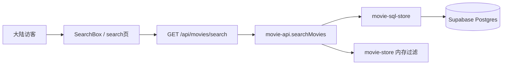
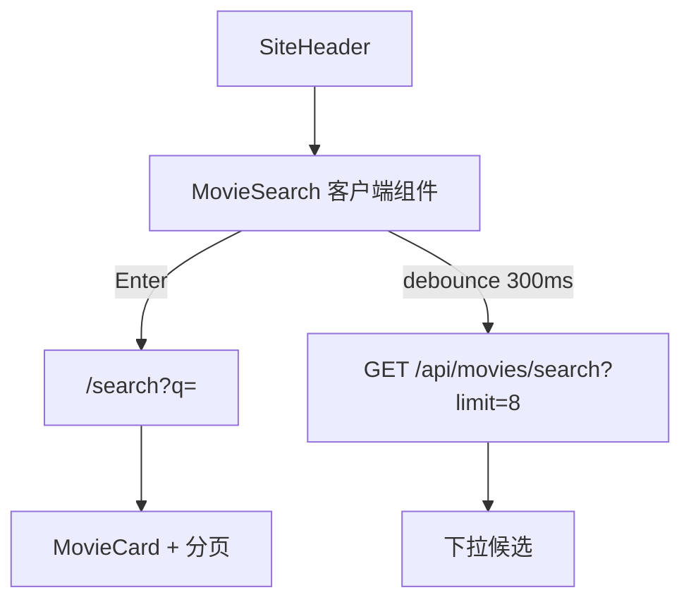

# 站点电影搜索方案

> 本文档描述 Station Zero **访客侧电影搜索**的技术方案：支持片名、IMDB 编号、影人（导演 / 主演 / 编剧）查询。  
> **不含实现代码**；实施前以本文 + [AGENTS.md](../../AGENTS.md) 数据读取原则为准。产品成功指标见 [station-zero-prd-v0.2.md](../product/station-zero-prd-v0.2.md) §11.2「搜索与筛选使用率」。

## 背景与目标

### 用户场景

竞品（如万级影视索引站）除列表分页外，主要依赖 **搜索** 与 **IMDB 直链** 触达历史片库。本站规划 1 万+ 已发布影片后，仅靠 `/movies` 分页不足以覆盖长尾。

访客应能：

| 输入类型 | 示例 | 期望 |
|----------|------|------|
| 片名 | `沙丘`、`Dune`、`肖申克的救赎` | 匹配中文名、英文名、别名 |
| IMDB 编号 | `tt0137523`、`0137523` | 精确命中对应影片 |
| 影人 | `张艺谋`、`Timothée Chalamet` | 匹配导演、主演、编剧相关影片 |

### 产品边界

- 只搜索 **本站已入库** 影片；结果集仅 `content_status = published`（与列表页一致）。
- **不在用户请求期间调用 TMDB** 或其他外部搜索 API；搜索只读本站 Postgres / JSON 回退。
- 浏览器不直连 Supabase；经 Next.js app server（SSR / Route Handler）查询。
- 搜不到时提示「本站暂无索引」，不引导用户去外部资源站检索。

### 非目标（首版不做）

- 实时 TMDB 全球片库搜索（结果不等于本站有资源索引）。
- 独立影人详情页 / `people` 表（可作为二期）。
- Elasticsearch、Typesense 等独立搜索引擎（万级规模 Postgres 足够）。
- 复杂筛选器（年份区间、类型多选等；可后续叠加）。

---

## 现状与缺口

### 可直接用于搜索的字段

当前 `movies` 表（见 `src/db/schema.ts`）：

| 字段 | 类型 | 搜索用途 |
|------|------|----------|
| `title` | text | 中文片名 |
| `original_title` | text | 英文/原始片名 |
| `aka` | text[] | 别名 |
| `director` | text | 导演 |
| `cast` | text[] | 主演 |
| `writers` | text[] | 编剧 |
| `year` | text | 结果展示、消歧 |
| `slug` | text | 详情页链接 |
| `tmdb_id` | integer | 后台同步，访客一般不搜 |

已有索引：`movies_content_status_updated_at_idx`、`movies_tmdb_id_idx`。

### 关键缺口：IMDB 编号

当前 `ratings.imdb`（jsonb）存的是 **评分展示字符串**，bulk-ingest 同步时甚至用 TMDB `vote_average` 填充，**不是** `tt0137523` 这种外部 ID。

- Schema **无** `imdb_id` 列。
- 同步脚本 **未** 拉取 TMDB `external_ids.imdb_id`。

**结论：** 「按 IMDB 编号搜索」必须先补数据层，不能仅靠现有字段。

### 影人数据形态

导演 / 主演 / 编剧为 **扁平文本**（`director` + 数组），无独立 `people` 表。首版可做「按名字搜到相关影片」，无法做影人作品全集页。

### 读取层现状

- 门面：`src/lib/movie-api.ts`（SQL 优先 + JSON 回退）。
- SQL：`src/lib/movie-sql-store.ts` — 仅有列表分页、slug 详情，**无 search**。
- API：`GET /api/movies?page=` — 仅分页，供首页加载更多。
- UI：头部导航无搜索框；无 `/search` 路由。

---

## 推荐架构



**原则：**

1. 查询意图解析在服务端（识别 IMDB / 片名 / 影人）。
2. 页面与 API 只通过 `movie-api` 取数，不直连 `movie-sql-store`。
3. SQL 路径使用 Postgres 索引查询，支撑 1 万+ 条。
4. JSON 回退保留可用性，但精度与性能弱于 SQL（开发 / 无库环境）。

---

## 数据层改造

### 新增字段

```sql
ALTER TABLE movies ADD COLUMN imdb_id text;
-- 规范形态：tt0137523（小写 tt + 数字）

CREATE UNIQUE INDEX movies_imdb_id_unique_idx
  ON movies (imdb_id)
  WHERE imdb_id IS NOT NULL;
```

Drizzle：`src/db/schema.ts` 增加 `imdbId: text("imdb_id")`，`npm run db:generate` + `db:migrate`。

### 入库同步补齐

`ingest:sync`（及可选 legacy `sync:movies`）拉 TMDB 详情时：

```
append_to_response=external_ids
```

写入：

```txt
movies.imdb_id = details.external_ids.imdb_id ?? null
```

**存量 backfill（建议）：** 对已发布且有 `tmdb_id` 的影片跑一次性脚本，补全 `imdb_id`；否则 IMDB 搜索仅对新入库有效。

### 搜索索引（pg_trgm）

万级规模不建议纯 `ILIKE '%关键词%'`（难走索引）。推荐启用 `pg_trgm`：

```sql
CREATE EXTENSION IF NOT EXISTS pg_trgm;

CREATE INDEX movies_title_trgm_idx
  ON movies USING gin (title gin_trgm_ops);
CREATE INDEX movies_original_title_trgm_idx
  ON movies USING gin (original_title gin_trgm_ops);
CREATE INDEX movies_director_trgm_idx
  ON movies USING gin (director gin_trgm_ops);
```

`aka` / `cast` / `writers` 可在查询时用 `unnest` + trigram，或二期合并为 generated `search_document` 单列 + 单一 GIN 索引（万级前优化项）。

---

## 查询策略

### 输入规范化

```txt
trim(q)
IMDB 模式：匹配 ^tt?\d{7,8}$ → 规范为 tt + 7~8 位数字
最小长度：普通文本 ≥ 2 字符；IMDB 模式例外
```

### 分支逻辑

```txt
输入 q
  ├─ IMDB 模式
  │     WHERE content_status = 'published' AND imdb_id = $normalized
  │     LIMIT 1（或仍走分页结构）
  └─ 文本模式
        WHERE content_status = 'published'
          AND (
            title % $q
            OR original_title % $q
            OR director % $q
            OR EXISTS (SELECT 1 FROM unnest(cast) c WHERE c % $q)
            OR EXISTS (SELECT 1 FROM unnest(writers) w WHERE w % $q)
            OR EXISTS (SELECT 1 FROM unnest(aka) a WHERE a % $q)
          )
        ORDER BY GREATEST(
          similarity(title, $q),
          similarity(original_title, $q)
        ) DESC, updated_at DESC
        LIMIT $pageSize OFFSET $offset
```

`%` 为 pg_trgm 相似度操作符；可按实测调整阈值（`SET pg_trgm.similarity_threshold`）。

### JSON 回退（无 DATABASE_URL）

在 `movie-store` 对已发布列表做内存过滤：

- IMDB：精确匹配（JSON 类型需扩展 `imdbId` 字段）。
- 片名 / 影人：`toLowerCase().includes(q)`。

仅保证开发可用，不作为生产主路径。

---

## API 与路由

### 页面

| 路径 | 渲染 | 说明 |
|------|------|------|
| `GET /search?q=&page=` | SSR | 完整搜索结果；`revalidate` 可设短于列表（如 3600）或 `dynamic` |

复用 `MovieCard` 网格 + `MoviePagination`；空结果展示引导文案。

### API

| 路径 | 说明 |
|------|------|
| `GET /api/movies/search?q=&page=&limit=` | JSON；`limit` 可选，供头部联想（默认 8） |

**响应形状**（建议扩展 `MoviesPageResult`）：

```ts
type SearchMoviesResult = MoviesPageResult & {
  query: string;
  matchedBy?: "imdb" | "title" | "person";
};
```

### 与现有 API 关系

- `GET /api/movies?page=` — 保持不变，仅分页全量 published。
- 搜索独立路径，避免 `?q=` 与 `?page=` 语义混淆。

---

## UI 入口（建议）



| 端 | 位置 |
|----|------|
| 桌面 | 导航 pill 与 `ThemeToggle` 之间 |
| 移动 | `mobile-nav` 顶部搜索或独立图标 → 全屏输入 |

结果卡片建议副标题：`year · director`；影人匹配时可标注「导演匹配」等（`matchedBy`）。

---

## 代码落点（实施时）

| 层级 | 路径 |
|------|------|
| Schema | `src/db/schema.ts` + `drizzle/*.sql` |
| SQL 查询 | `src/lib/movie-sql-store.ts` → `searchPublishedMoviesFromSql(q, page, pageSize)` |
| 门面 | `src/lib/movie-api.ts` → `searchMovies(q, page, pageSize?)` |
| JSON 回退 | `src/lib/movie-store.ts` |
| Route Handler | `src/app/api/movies/search/route.ts` |
| 页面 | `src/app/search/page.tsx` |
| 组件 | `src/components/movie-search.tsx`（client） |
| 头部接入 | `src/components/site-header.tsx` / `site-nav.tsx` |
| 入库 | `scripts/bulk-ingest/sync-movies-to-sql.mts` 写 `imdb_id` |
| 存量 | `scripts/bulk-ingest/backfill-imdb-ids.mts`（规划） |

---

## 分期实施

### Phase A — MVP（约 2–3 天）

- [ ] Migration：`imdb_id` + `pg_trgm` 索引
- [ ] Sync 写入 `imdb_id`；可选存量 backfill
- [ ] `searchMovies` + `/search` 页面
- [ ] 头部搜索框（提交跳转 `/search`，可无联想）
- [ ] 测试：IMDB 解析、SQL 查询、JSON fallback

### Phase B — 体验（约 1 天）

- [ ] `/api/movies/search` 联想下拉
- [ ] 空状态、非法 `q`、loading 态
- [ ] 键盘导航（↑↓ Enter）

### Phase C — 万级优化（约 1–2 天，全量录入前）

- [ ] `search_document` 合并字段 + 单索引
- [ ] 慢查询监控；`statement_timeout` 护栏
- [ ] 压测：1 万条 published 下 P95 延迟

---

## 风险与对策

| 风险 | 影响 | 对策 |
|------|------|------|
| 存量无 `imdb_id` | IMDB 搜不到老片 | backfill；未命中时提示改搜片名 |
| `ratings.imdb` 与 `imdb_id` 混淆 | 实现错误 | 文档与代码命名区分；评分保留在 `ratings` |
| 影人同名 | 结果噪音 | 展示 year + director；相似度排序 |
| 中文分词弱 | 长片名匹配差 | pg_trgm substring 仍可用；二期 FTS / zhparser |
| JSON 模式功能缩水 | 本地无库体验差 | README 标明完整搜索需 `DATABASE_URL` |
| 搜索被刷 | DB 压力 | `q` 长度上限；Route Handler 可选 rate limit |

---

## 验收标准

1. `tt0137523` 能命中对应已发布影片（需该条 `imdb_id` 已入库）。
2. 中文片名、英文名、别名各抽 5 部命中详情页。
3. 导演 / 主演名能返回其相关影片（结果含匹配说明）。
4. 未发布 `draft` 不出现在搜索结果。
5. `npm test` / `npm run build` 通过；无 `DATABASE_URL` 时 JSON 回退不抛错。
6. PRD 指标可埋点：`search_submit`、`search_result_click`（二期分析）。

---

## 待拍板项

| # | 问题 | 建议默认 |
|---|------|----------|
| 1 | 搜索入口：仅 `/search` 还是头部全局 + 联想？ | 头部全局 + `/search` 完整结果 |
| 2 | 是否对存量 100+ 部跑 IMDB backfill？ | 是（一次性 TMDB 拉取） |
| 3 | 影人匹配是否标注原因？ | 是（`matchedBy: person`） |
| 4 | draft 是否可被搜索？ | 否（与列表一致） |

---

## 相关文档

- [station-zero-prd-v0.2.md](../product/station-zero-prd-v0.2.md) — 产品边界与成功指标
- [bulk-ingestion-scheme.md](./bulk-ingestion-scheme.md) — 竞品搜索行为、万级录入背景
- [AGENTS.md](../../AGENTS.md) — `movie-api` 读取原则、页面路由
- [docs/index.md](../index.md) — 文档总览
