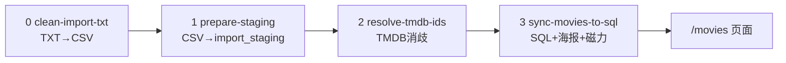

# Scripts 目录说明

> 后台脚本，**不经由页面调用**。分四条线：预检、单部录入（文件库）、批量录入（SQL）、共享库。

## 目录结构

```txt
scripts/
├── index.md                  # 本文件
├── checks/                   # 跑流水线前的连通性检查
├── legacy/                   # MVP 文件库 workflow（movies.json）
├── bulk-ingest/              # 万级批量录入流水线（Supabase SQL）
└── lib/                      # 共享模块（不直接运行）
```

## 我该跑哪条线？

| 场景 | 用哪条 |
|------|--------|
| 录入 1–20 部，编辑 seeds JSON | `legacy/sync-movies.mjs` |
| 万级 CSV / 磁力批量入库 | `bulk-ingest/` 流水线 |
| 只想确认环境 OK | `checks/` |

## 批量录入流水线（bulk-ingest）



| 步骤 | 脚本 | npm 命令 | 输入 → 输出 |
|------|------|----------|-------------|
| 0 清洗 | `bulk-ingest/clean-import-txt.mjs` | （手动 node） | 原始 TXT → `movies-clean.csv` |
| 1 入缓冲 | `bulk-ingest/prepare-staging.mts` | `npm run ingest:staging` | CSV → `import_staging` 表 |
| 2 消歧 | `bulk-ingest/resolve-tmdb-ids.mts` | `npm run ingest:resolve` | staging → 写入 `tmdb_id` |
| 2b ambiguous | `bulk-ingest/resolve-ambiguous.mts` | `npm run ingest:resolve-ambiguous` | 自动/半自动消歧 |
| 2c failed | `bulk-ingest/resolve-failed.mts` | `npm run ingest:resolve-failed` | 中文片名 + 年份容差重试 |
| 3 落库 | `bulk-ingest/sync-movies-to-sql.mts` | `npm run ingest:sync` | TMDB w500/w1280 → 480px WebP → `movies` + Storage |
| 3b Storage | `bulk-ingest/upload-media-to-storage.mts` | `npm run ingest:upload-media` | 本地海报压缩后补传到 Supabase Storage |
| 一键 Pilot | `bulk-ingest/run-pilot-ingest.mts` | `npm run ingest:pilot` | 串联 1→2→3（默认 100 部） |

共享逻辑在 `bulk-ingest/shared.mts`（CSV 解析、TMDB 客户端、SQL 字段映射）。

## 单部录入（legacy · 文件库）


| 脚本 | npm 命令 | 作用 |
|------|----------|------|
| `legacy/sync-movies.mjs` | `npm run sync:movies` | seeds → TMDB → `movies.json` + 海报 |
| `legacy/import-movies.mjs` | `npm run import:movies -- file.json` | 外部 JSON 合并进 `movies.json` |
| `legacy/extract-palettes.mjs` | `npm run extract:palettes` | 离线海报取色回写 JSON |
| `legacy/migrate-json-to-sql.mts` | `npm run db:migrate:json` | 一次性 JSON → SQL |

## 预检（checks）

| 脚本 | npm 命令 | 作用 |
|------|----------|------|
| `checks/check-database.mjs` | `npm run check:database` | `DATABASE_URL` + 四张核心表 |
| `checks/check-tmdb.mjs` | `npm run check:tmdb` | TMDB 凭证与网络 |
| `checks/check-storage.mjs` | `npm run check:storage` | Supabase Storage 上传凭证（`SUPABASE_SERVICE_ROLE_KEY`） |

## 相关文档

| 主题 | 文档 |
|------|------|
| 文档总览 | [docs/index.md](../docs/index.md) |
| 万级录入操作手册 | [docs/technical/bulk-ingestion-runbook.md](../docs/technical/bulk-ingestion-runbook.md) |
| 图片与 Storage 策略 | [docs/technical/movie-images.md](../docs/technical/movie-images.md) |
| 海报体积优化 | [docs/technical/poster-compression-scheme.md](../docs/technical/poster-compression-scheme.md) |

**bulk-ingest 图片 env（可选，见 `.env.example`）：** `TMDB_IMAGE_BASE_URL`（默认 w500）、`TMDB_BACKDROP_IMAGE_BASE_URL`（默认 w1280）、`POSTER_MAX_WIDTH`、`POSTER_WEBP_QUALITY`、`BACKDROP_MAX_WIDTH`、`BACKDROP_WEBP_QUALITY`。

## 共享库（lib）

| 模块 | 被谁引用 |
|------|----------|
| `lib/movie-database.mjs` | legacy 三脚本 |
| `lib/palette.mjs` | legacy/sync、legacy/extract-palettes、bulk-ingest/sync |
| `bulk-ingest/compress-image.mts` | bulk-ingest/sync、upload-media（sharp → WebP） |

## 推荐执行顺序（Pilot）

```bash
npm run check:database
npm run check:tmdb
npm run db:migrate          # 若 schema 未落库
npm run ingest:pilot        # 100 部端到端
```

报告见 `data/import/*-report.txt`。本目录说明见 [data/import/index.md](../data/import/index.md)。细节见 [bulk-ingest/index.md](./bulk-ingest/index.md)；操作手册见 [docs/technical/bulk-ingestion-runbook.md](../docs/technical/bulk-ingestion-runbook.md)；文档总览见 [docs/index.md](../docs/index.md)。
